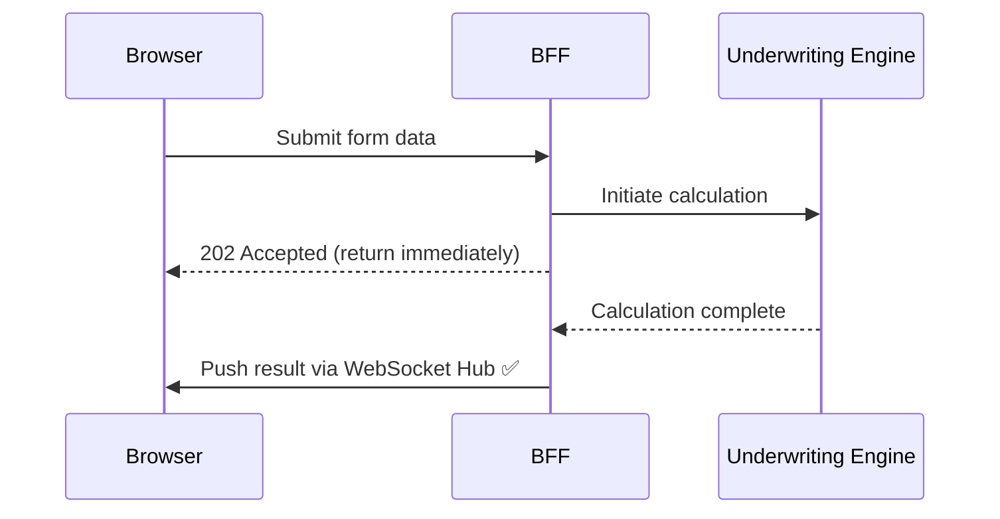
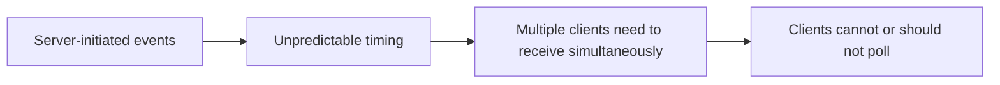
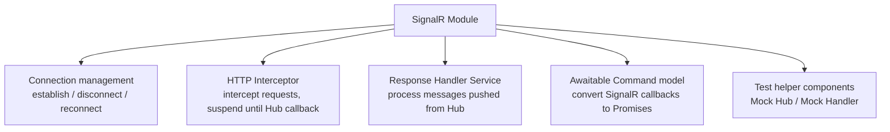
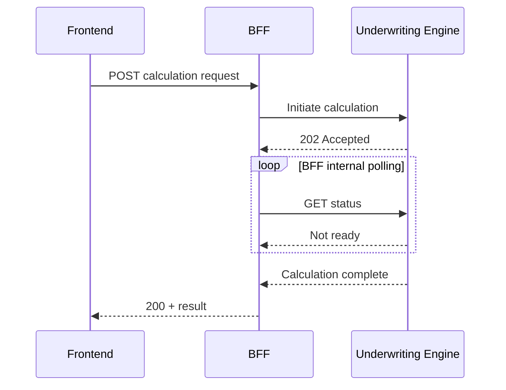
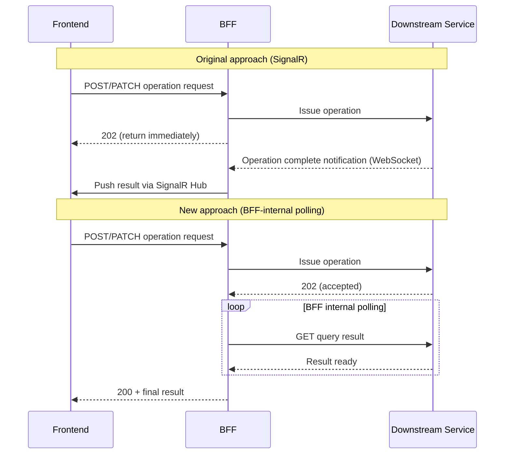

## 1. What We're Building

Our system is an online insurance quoting platform. A user opens a web page, answers a series of questions — vehicle details, driving history, personal information — and the system calculates a premium in the background, presenting a final price for the user to accept or decline.

The flow spans more than a dozen steps. At each step forward, the backend sends the newly collected data to a downstream underwriting engine, retrieves the latest quote result, and displays it to the user.

**The core interaction model is simple: user fills in → backend calculates → frontend shows result → user continues.**

---

## 2. How SignalR Got In

At project kick-off, the team faced a design question: the underwriting engine's calculation is asynchronous — it can't return a result immediately. How do you push the result back to the frontend?

At the time, the underwriting engine and our application were part of the same deployment unit, and the team had full control over it. The technology choice was **SignalR** — Microsoft's standard solution for real-time bidirectional communication in the .NET ecosystem, built on WebSockets with fallback support for Server-Sent Events and Long Polling.

On the architecture diagram, the solution looked elegant:



The user doesn't have to wait — the backend pushes at the exact moment the calculation finishes, with minimal latency.

Was this the right choice? **In certain scenarios, absolutely.**

Over time, however, the underwriting engine was split out into an independent microservice, maintained by a separate team. **Our application became a pure consumer — able only to call the interfaces it exposed, with no ability to modify its behaviour.** What had once been an "internal implementation detail" was now a coupling point spanning a service boundary. By the time we started re-examining this design, the architectural reality had changed completely from when the original decision was made.

---

## 3. What SignalR Is Actually Good For

Before diving into our problems, let's establish a baseline: SignalR is a solid technology. It solves a real class of problems.

The scenarios where SignalR genuinely shines share these characteristics:



Canonical examples:
- **Collaborative documents** (like Google Docs): any user's edit must be synchronised in real time to everyone else with the document open
- **Stock price dashboards**: prices change every second; push is far more efficient than polling
- **Chat rooms**: message arrival is completely unpredictable; frequent polling wastes resources
- **High-concurrency notification systems**: tens of thousands of connections simultaneously waiting for server-side pushes

What these scenarios have in common: **the server needs to broadcast to multiple connections, or the timing of events is truly unpredictable — the wait could be seconds or hours.**

---

## 4. Looking Back at Our Actual Situation

Now apply that standard to our scenario.

**How slow is our underwriting calculation?**

From monitoring data: the vast majority of calculations complete in **1–2 seconds**, with the slowest cases under 5 seconds. This isn't "unpredictable, potentially long-duration waiting" — it's a known, bounded window.

**How many concurrent users are waiting?**

Our platform sees tens of thousands to low hundreds of thousands of visits per day — a normal scale for a consumer insurance business. Even at peak, the number of users concurrently waiting for a quote calculation is quite limited. Insurance quoting is a **deliberate, step-by-step process**, not a flash sale.

**Does the result need to be broadcast to multiple clients?**

Not at all. Each calculation result belongs only to the one user who initiated that request. There is zero broadcast requirement.

A direct comparison:

| Characteristic | Where SignalR fits | Our actual situation |
|----------------|--------------------|----------------------|
| Wait duration | Unpredictable (seconds to hours) | Known (1–5 seconds) |
| Number of receivers | Broadcast to multiple clients | Only the requesting user |
| Concurrent connection scale | Tens of thousands of persistent connections | Small number of brief waits |
| Who triggers the event | Server-initiated | In response to user action |

**Conclusion:** Our scenario simply does not need SignalR. We brought a sledgehammer to drive a thumbtack.

---

## 5. The Real Cost of Maintaining SignalR

An ill-fitting architecture is a design problem, but at the engineering level it gradually becomes a **maintenance burden**.

**Frontend complexity**

To integrate with the SignalR Hub, the frontend had to maintain an entire infrastructure:



More than 10 files, each requiring development, testing, and maintenance. Every framework upgrade needed verification that this mechanism still worked. Every new engineer needed an explanation of "why does sending an HTTP request require waiting for a WebSocket callback before execution continues?"

**Backend dependencies**

The backend needed:
- A dedicated Azure SignalR Service (a managed service with its own cost)
- Hub class and connection management logic
- A full set of configuration options and validators

**Test friction**

Unit tests required mocking Hub behaviour; integration tests had to ensure WebSocket connections were stable in the test environment. These extra test infrastructure pieces created friction on every iteration.

---

## 6. The Alternatives We Evaluated

Before deciding to remove SignalR, we assessed several alternatives — worth going through one by one to explain **why we didn't choose them**.

### Option A: BFF-internal synchronous wait (making HTTP "look synchronous")

The BFF receives the frontend request, polls the downstream calculation service internally, and only returns to the frontend once it has the result. From the frontend's perspective, there is a single request/response.



**Why we didn't choose it:**
- BFF HTTP connections have timeout limits (typically 30–60 seconds); if a calculation occasionally exceeds this, the frontend receives a 504 rather than a normal result
- BFF threads are blocked during the wait, increasing thread pool pressure under load
- Most importantly: the underwriting engine was by now an independent microservice — **it only exposed a GET query interface, with no way for us to make it support "synchronous wait" semantics** — we simply couldn't change how it responded

### Option B: Server-Sent Events (SSE)

SSE is HTTP's one-way "streaming" mechanism: the server can continuously push data to the frontend, which receives via the `EventSource` API. Lighter than SignalR, no WebSocket required.

Why we didn't choose it:
- Still requires a persistent connection; maintenance cost compared to SignalR is reduced but not eliminated
- Given that our known wait time is only 1–5 seconds, the overhead of keeping a connection open is not worth it
- Interaction with the downstream service still boils down to HTTP + polling; the only benefit of SSE would be in the frontend layer

### Option C: Polling (what we ultimately chose)

The frontend issues an operation request. The BFF internally sends status queries to the downstream service until it confirms completion, then returns the final result to the frontend.

This is precisely the pattern that SignalR was originally designed to "replace." In our scenario, **it turned out to be the most appropriate choice.**

---

## 7. Our Final Solution: BFF-Internal Polling

The architectural change looks like this:



From the user's perspective, the experience is identical: click "Continue," a spinner appears, and 1–2 seconds later the next step loads.

**Polling strategy design**

Polling is not an infinite loop. We use a **linear incremental backoff** strategy:

```
Poll 1: wait 1 second
Poll 2: wait 2 seconds
Poll 3: wait 3 seconds
...
Poll 7: wait 7 seconds
Maximum total wait: 28 seconds (1+2+3+4+5+6+7)
```

**Why does the second poll usually give us the result?**

This is the most critical engineering detail in the article: the downstream service caches GET responses, and every data mutation invalidates and immediately updates the cache. From the time a mutation request (POST/PATCH) is sent to when the cache is updated typically takes less than 1 second. So:

- Poll 1 (after a 1-second delay): hits the already-updated cache — almost always returns the result
- Only in rare cases (when the downstream service is under higher load) are polls 2 or 3 needed

In practice, 99% of cases complete within the first two polls, and the wait time perceived by users is indistinguishable from the original SignalR solution.

**Where does polling apply?**

Our polling is used for two categories of operation:

1. **Create/delete operations**: after issuing a POST or DELETE, confirm via GET that the resource has been created or deleted (GET returning 200 confirms creation; returning 404 confirms deletion)
2. **Update operations**: after issuing a PATCH, read the field values back via GET and compare against the expected values rather than relying solely on the status code

---

## 8. Pitfalls of Polling — and How We Handled Them

Polling looks simple, but there are a few details worth taking seriously in a production environment.

### Pitfall 1: What happens when we time out?

28 seconds is already a long maximum wait. If we've polled 7 times and still haven't received the expected result, something is seriously wrong with the downstream service.

Our approach: once the maximum retry count is exceeded, throw an exception, log detailed error information (including the actual state returned by the last GET), and return a 500 to the frontend, directing the user to contact support.

This is far better than leaving the user staring at a spinner indefinitely.

### Pitfall 2: Test suites become unbearably slow

If 28 seconds of total wait time ends up inside a unit test, each test case takes tens of seconds, and the entire test suite becomes unusable.

Our approach: design the polling delay as an **injectable property** (set to 1 millisecond in the test environment). Unit tests complete in milliseconds; production behaviour and test behaviour are perfectly consistent.

```
Production: DelayMillisecondsPerRetry = 1000 (each wait = N × 1 second)
Test:       DelayMillisecondsPerRetry = 1     (each wait = N × 1 millisecond)
```

A small design detail, but one that saves a significant amount of test time in practice.

### Pitfall 3: BFF threads blocked during polling

The BFF's internal polling is implemented with `async/await`. During the wait, the thread is released back to the thread pool (`Task.Delay` is non-blocking), so there is no thread starvation. This is standard usage of the modern .NET async model — no special handling required.

### Pitfall 4: Don't confuse Polly retries with business-level polling

Our HTTP client is configured with both a Polly retry policy (for transient failures such as network errors and 5xx responses) and business-level polling (for waiting on downstream data synchronisation). The two are easy to conflate, and it's important to keep them clearly separated:

| | Polly retry | Business polling |
|--|-------------|-----------------|
| Trigger | HTTP error (5xx, network exception) | Business state not yet ready (data not synced) |
| Layer | HTTP client layer | Business service layer |
| Expected outcome | Retry yields a normal response | Retry yields data matching expected value |
| On final failure | Wrapped as HTTP exception | Wrapped as business exception |

In plain terms: Polly handles "the request failed — retry it"; business polling handles "the request succeeded, but the data hasn't updated yet — check again." These are two completely different problems.

---

## 9. The Result

A single PR to remove SignalR (`a6e569dd`):

- **77 files** changed
- Over **1,200 lines** of code deleted
- Net reduction of **548 lines**
- **253 lines** of new unit tests added in the same PR

From that point on, "the frontend issues an operation and waits for the result" no longer requires a WebSocket connection, a Hub class, an Interceptor, a ResponseHandler, or an AwaitableCommand. It's a plain HTTP request, plus a polling loop quietly doing its job inside the BFF.

---

## 10. Closing Thoughts: Elegant Architecture Doesn't Always Mean the Right Fit

SignalR isn't wrong. It's excellent technology with scenarios where it genuinely shines.

The real lesson here is: **when choosing a technical solution, fit matters more than sophistication.** Over-investing at the architecture level often isn't a sign of poor engineers — it's a sign that the intuition of "this technology looks correct" has obscured the question of "is this technology actually necessary for us?"

A few questions worth asking yourself at the next technology selection:

1. Is our data update truly "unpredictable" — or just "a little slow"?
2. Does this result need to be pushed to "multiple receivers," or only to the one person who made the request?
3. If we used the simplest possible polling implementation, what's the worst-case wait time for the user? Is that acceptable?
4. What is the maintenance cost for the team three months after introducing this technology?

Sometimes, one fewer dependency is the best architecture you can have.