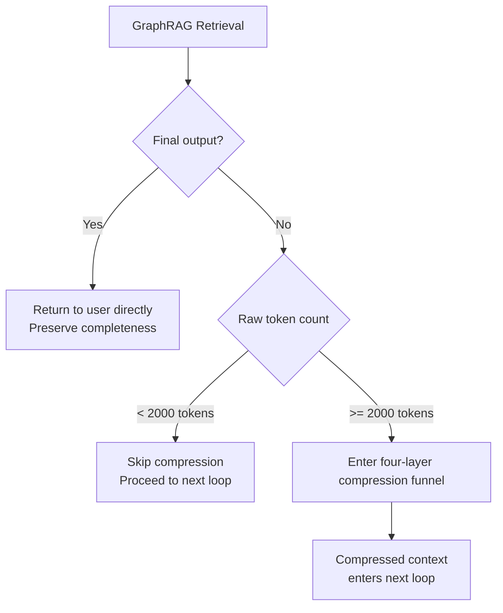
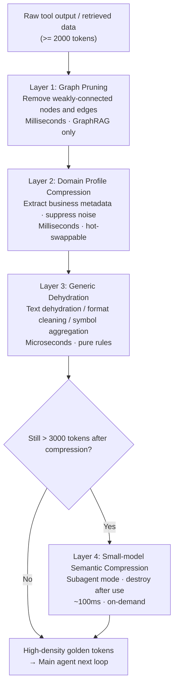

# The Dual-Engine Agent: A Four-Layer Compression Funnel for Faster, Cheaper General-Purpose Agents

## Introduction

RTK and CodeGraph have been making waves in the AI engineering community lately — and for good reason. They address two concrete, painful problems that every coding agent builder has hit.

Take Claude Code as an example. When an agent needs to understand an unfamiliar codebase, the naive approach is to shell out `grep`, `find`, and `cat` via bash tools. Each call returns a raw batch of text with an extremely low signal-to-noise ratio — useful information buried under irrelevant code. Worse, a single search is almost never enough. The agent has to call tools again and again, piecing together the full picture like a jigsaw puzzle. Loop counts easily climb past ten. Every round burns tokens. Every round adds latency.

**CodeGraph** attacks the *time* dimension: it pre-parses the codebase into a symbol call graph, so the agent can directly query "which modules call function A, and which interfaces does it depend on?" — replacing 3–5 bash tool calls with a single graph lookup, dramatically reducing the number of agent loops.

**RTK (Real-Time Kompressor)** attacks the *space* dimension: it intercepts raw tool output in real time, compresses and truncates it, and distills a 4,000-token bash dump into a few hundred tokens of structured key information — cutting per-call token consumption by 60–90%.

The combined effect is compounding: fewer loops, plus fewer tokens per loop. Total cost can drop to under 15% of the baseline.

---

But here is the question: **is this approach only useful for coding agents?**

When you push an agent into large enterprise knowledge bases or non-coding verticals — legal compliance, medical records, multi-source financial auditing — the same two walls still exist. Database queries, API calls, and document retrieval all return noisy bulk output. Multi-hop reasoning still triggers repeated tool calls. The medium is different; the problem is identical.

This article ports the core ideas behind RTK and CodeGraph to **general-purpose agents**, proposing a "Dual-Engine" architecture: **Engine 1** uses GraphRAG to reduce the number of tool calls at the retrieval source (the CodeGraph analog); **Engine 2** uses a four-layer compression funnel to cut token noise on every loop iteration (the RTK analog).

---

## RTK + CodeGraph: Optimizing Two Dimensions

| | RTK | CodeGraph |
|---|---|---|
| **Role** | Data compression layer | Knowledge index layer |
| **Pain point** | Space: too much noise per tool output | Time: agent makes too many blind tool calls |
| **Mechanism** | Real-time interception and compression of bash output; structured truncation + KV extraction | Pre-built symbol call graph; agent queries the graph instead of running commands |
| **Effect** | 60–90% reduction in per-call token consumption | 2–10× reduction in agent loop count |

The shared insight behind both:

> **The LLM doesn't need to see raw data. It needs to see the information that is useful to it.**

The compounding math: if CodeGraph reduces 10 loops to 5, and RTK reduces per-loop tokens from 4,000 to 1,200, the combined cost is **15%** of the original — not simply the sum of the two savings rates.

---

## Two-Layer Architecture: Reduce Calls First, Then Decide Whether to Compress

Porting this to a general-purpose agent means replacing bash commands with database queries, API calls, and document retrieval. Where should the "knowledge graph" be built? The answer is **GraphRAG**.

### Engine 1: GraphRAG Reduces Tool Calls

Traditional vector RAG excels at "find semantically similar passages," but struggles with complex relational queries. For example, "find all compliance risk clauses associated with client A" — a vector search returns a pile of isolated text chunks, and the agent still has to chain multiple tool calls to connect the relationships.

GraphRAG, at index time, decomposes documents into an **entity-relationship graph** and **community summaries**. At retrieval time, it returns not just similar passages but also upstream/downstream relationship nodes and aggregated community summaries for each entity. **A single retrieval can replace what would otherwise require 3–5 tool calls to assemble** — the direct analog of CodeGraph in the general domain.

### Engine 2: The Compression Gatekeeper

After GraphRAG retrieves data, don't rush to stuff it all into context. First ask: **is this the final step of the current loop?**



Two key design decisions:

1. **Never compress final output**: Content going to the user preserves full fidelity. Compression gains happen only in intermediate loops.
2. **Dynamic gatekeeper threshold**: If the raw data is already small (< 2,000 tokens), the overhead of compression exceeds the benefit. Skip it.

---

## The Four-Layer Compression Funnel

Data that passes the gatekeeper enters a four-stage sequential pipeline. Each layer gets "smarter" — and more expensive. In practice, enable layers on demand based on actual token volume.



### Layer 1: Graph Pruning

Enabled only when using GraphRAG. The subgraph returned by GraphRAG contains many peripheral nodes that are not relevant to the current task. Filter weak edges and marginal nodes based on node weight (PageRank / degree centrality), keeping only the core entity–relation–entity causal chains.

- Tools: NetworkX graph filtering / GraphRAG built-in pruning API
- Typical effect: 30–50% reduction in raw text volume, no semantic reasoning required, extremely fast

### Layer 2: Domain Profile Compression

The most domain-specific layer — highest development investment, highest ROI:

| Domain | Keep | Discard |
|---|---|---|
| Financial compliance | Amounts, dates, counterparties, clause keywords | Formatting declarations, boilerplate risk warnings, disclaimers |
| Legal | Parties, dates, statutory citations, judgment conclusions | Procedural statements, citation formatting headers/footers |
| Customer service | Customer issue, order number, timestamps, resolution | Greeting phrases, scripted language |

Implementation: **rule engine (regex) + small NER model**. Designed to be hot-swappable — swap a profile config, change industries, no code changes required.

### Layer 3: Generic Dehydration

Pure rule-based processing, no domain knowledge required:

- **Text dehydration**: Remove redundant connectives ("furthermore," "it is worth noting that"), duplicate phrasing
- **Format cleaning**: Strip markdown decorators, excess whitespace, HTML residue
- **Symbol aggregation**: `1, 2, 3, 4, 5` → `[1-5]`; long URLs → `[URL_1]` (original cached for lookup)

Reference tools: LLMLingua (perplexity-based token-level compression) or a custom regex pipeline.

### Layer 4: Small-Model Semantic Compression (Subagent Mode)

The first three layers handle structural noise, but semantic redundancy — the same idea expressed multiple ways, background explanations irrelevant to the current loop — requires genuine language understanding to resolve.

**Model selection criteria**: extremely fast inference, very cheap per token, context window ≥ 32K.  
**Candidate models**: Qwen2.5-7B-Instruct, Phi-4-mini, Gemma-3-4B.

**Engineering constraints**:

1. Launched as an **isolated subagent** — it does one thing: compress
2. **Destroyed immediately** after the task is complete, with no shared conversation history with the main agent — this is a hard requirement to prevent context contamination
3. Minimal prompt, no room for the model to "improvise":

```
You are an information distiller. Compress the following content to its core information.
Preserve all key facts and causal dependencies.
Remove all redundant phrasing. Do not add any qualifiers or decorative language.

{text}
```

After the first three layers, the small-model pass achieves a final compression ratio of **5–10×**.

---

## The Safety Net: Preventing Over-compression

The four-layer funnel carries one risk: a layer accidentally strips information that looks like noise but is actually critical, causing the main agent to mis-reason and retry — which increases loop count rather than reducing it.

### Defense: Expand on Demand

Every compressed data chunk passed to the main agent carries a unique `context_id`. The original uncompressed text is cached in a local KV store (Redis or an in-memory dict). The main agent is also registered with a tool:

```python
def get_raw_output(context_id: str) -> str:
    """Call this when the compressed context creates a logical gap or you need to verify raw details."""
    return cache.get(context_id)
```

The system prompt tells the main agent:

> You are reading compressed data. If your reasoning encounters a logical gap or you need to verify a specific detail, call `get_raw_output` to access the original content.

This makes compression **reversible** — the main agent always retains the ability to trace back to source. Compression strategies can be more aggressive without risking irreversible information loss.

---

## When to Use It (and When Not To)

**Good fit**:
- Long-running agents with multiple tool call rounds (document analysis, multi-source data aggregation)
- Information-dense retrieval (legal documents, financial reports, technical documentation libraries)
- Vertical agents with a well-defined domain, where a custom Layer 2 profile can be built

**Poor fit**:
- Simple single-turn Q&A (the gatekeeper skips everything, but if your system never produces long outputs in the first place, introducing this architecture is over-engineering)
- Latency-sensitive scenarios requiring < 500ms responses (Layer 4 small-model inference adds non-trivial delay)

**Monitoring recommendation**: Log `token_in` / `token_out` at every layer and use OpenTelemetry to track the tradeoff between compression ratio and answer quality. If a layer causes answer quality to degrade, **disable that layer** rather than tuning its parameters — the whole point of the layered design is that each layer can be independently degraded.

---

## Conclusion

The time bottleneck (too many loops) and the space bottleneck (token overload) are the two most common performance problems for general-purpose agents on complex tasks. They are often conflated and treated with the same fix.

The Dual-Engine architecture decouples them: GraphRAG specifically counters the time bottleneck; the four-layer compression funnel specifically counters the space bottleneck; and the Expand on Demand safety net ensures compression remains reversible.

More importantly, it represents a shift in mental model:

> **The agent is a pipeline. Compression is a stage in that pipeline — not a side task delegated to the LLM.**

Replace "ask the LLM to summarize" with "a dedicated compression stage in the pipeline," and agent behavior becomes predictable, observable, and debuggable.

*Next: the .NET implementation — Semantic Kernel + Microsoft GraphRAG + LLMLingua, including the hot-swappable Layer 2 Profile design and the isolation pattern for Layer 4 subagents.*
