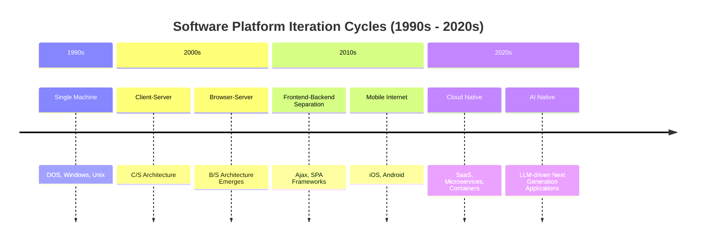

# The Hidden Cost of Over-Engineering: Why Systems Die from Platform Migration, Not Bad Code

Have you ever encountered this scenario: your team meets to discuss architecture, everyone talks about SOLID principles with confidence—interface segregation, dependency inversion—it all sounds right and impressive. But when each person gets back to their own tasks, they code the same way as before. Nobody sees anything wrong with it.

Is it a discipline problem? An attitude problem?

I don't think so. After nearly thirty years of work, I've seen many conscientious engineers. They understand design, and they're not lazy about doing it. But those principles just don't seem to stick. I've always believed there's a more fundamental reason behind it—it's just that few people explain it clearly.

---

## Software Engineering Borrowed the Wrong Time Scale

In 1968, NATO held a conference in Germany where the concept of "software engineering" was formally proposed for the first time. In that era, software development was growing increasingly large in scale, but lacked systematic methodologies. So engineers looked for guidance from the most mature engineering discipline—civil engineering.

This borrowing was natural and quite effective. Structured design, modular decomposition, documentation standards... many ways of thinking from civil engineering were transplanted to software, significantly improving code quality and maintainability.

But civil engineering had a hidden premise that we didn't carry along with us when we borrowed: **buildings are meant to last a long time.**

A bridge is typically designed with a 50 to 100-year lifespan. From planning to decommissioning, a building spans multiple generations. On such a time scale, investing significant engineering effort upfront makes perfect sense—the payback period is long enough that any optimization has the chance to be reused repeatedly.

Early software engineering operated similarly. Large mainframe systems often ran for decades, with stable and persistent core business logic. Back then, designing software by civil engineering standards seemed perfectly reasonable.

But that was decades ago.

---

## Seven to Ten Years, Then It Vanishes

In my nearly 30 years of development work, I've worked on projects big and small across multiple technological eras. If you ask me where those projects are today—most of them are gone.

Not because they were poorly written, but because the times changed.

Each platform iteration eliminates a batch of systems. Not because one system was poorly written, but because the entire environment it depended on disappeared.

Simply put, there are roughly three reasons these systems are decommissioned:

**Platform and Architecture Replacement.** From standalone machines to C/S, from C/S to B/S, from B/S to cloud SaaS. Each migration doesn't rebuild the old system—it replaces it. Previous code, however solidly designed, cannot directly continue.

**Technology Stack Evolution.** WebForms disappeared, replaced by the front-end and back-end separation triggered by Ajax, then various SPA frameworks. XML/SOAP gave way to JSON/REST. Communication technology evolved from 2G to 5G, completely changing the assumptions applications could make. Each time, the "design assets" accumulated from your previous project often reset to zero in the next one.

**Business and Organizational Change.** Companies go bankrupt, departments are dissolved, product directions pivot. Nortel Networks was once the world's largest telecommunications equipment manufacturer. The "99.999% reliability" that hung on its walls represented the pinnacle of an era. Yet, constrained by strategic miscalculations in technology direction and fierce business competition, after divesting the UMTS division where I worked and betting everything on CDMA, the company failed to break through and declared bankruptcy in 2009. The systems and core code accumulated by thousands of engineers over many years simply vanished. Looking back, a company's rise and fall is ultimately tied closely to the evolution and iteration of its technology trajectory.

Looking carefully, none of these three reasons have anything to do with code quality. They share one thing in common: **they all happen outside the code.**

---

## Systems Die from Business Disruption, Not Code Quality

From a technical standpoint, the decommissioning of these systems is lamentable. From a business standpoint, it's a perfectly normal outcome.

Platform replacement brings not just technical migration, but radical shifts in operational cost structure. When the maintenance cost of an old system far exceeds the business value it generates, or when a competitor on a new platform offers better experience at lower cost, the old system's fate is sealed—no matter how elegant its internal design.

Nokia phones are a good example. Nokia's hardware quality in the feature phone era was unmatched—solid craftsmanship, stable signal, unbreakable. Then the smartphone era arrived, and it was crushed by some random Android phone. Not because Nokia's quality got worse, but because user needs fundamentally changed. Quality is meaningless on the wrong platform.

The same is true for software systems. When users stop using your old system, or when a company can no longer accept the system's value/cost ratio, the system must be decommissioned.

I have a desktop computer from ten years ago with two DDR3 memory slots on the motherboard for future expansion—thoughtful design, accounting for future upgrade needs. But it's been gathering dust in the corner for years—not because it's out of memory, but because the entire era changed.

Those systems were the same. The redundant interfaces painstakingly designed, the extension points carefully planned, the abstraction layers reserved for future compatibility... by the time the system was decommissioned, most of them were never used.

**All those well-designed features ultimately became decorations.**

---

## Some Questions Worth Pausing to Consider

If a system has a lifespan of only seven years, is the design we do in year three or five—"for better extensibility in the future"—really worth it? Isn't this R&D cost essentially wasted?

Often, systems die not from bad code, but from strategic shifts, business pivots, or architecture changes. If it's not the code itself that determines a system's lifespan, then what problem are we trying to solve by obsessing over "future-proof code design"?

We must reflect: many so-called "sound investments" are fundamentally not driven by business needs, but only to satisfy our "technical perfectionism" and engineering passion.

These questions warrant slow reflection—we don't need to rush to an answer.

Of course, some design practices are exceptions. They deliver real returns every single day the system is alive: readability means the next person doesn't have to guess, testability gives confidence with every change, and clear domain models prevent business logic from hiding in technical layers. These are never the problem and should never be compromised.

But that's completely different from "pre-designing extension points for requirements that might never come."

---

## Epilogue

Perhaps those design principles that "everyone agrees are good when discussed but automatically ignores when implementing" aren't entirely a discipline problem. Perhaps engineers' intuition vaguely senses something without being able to articulate it.

Software engineering is still a young discipline. It was only formally named in 1968, barely half a century ago. It borrowed from civil engineering and manufacturing, but software itself has unique characteristics—the speed of its iteration, the way it dies, its intimate relationship with business—that differ from these predecessor disciplines.

Perhaps we're still exploring which practices truly belong to software itself.
