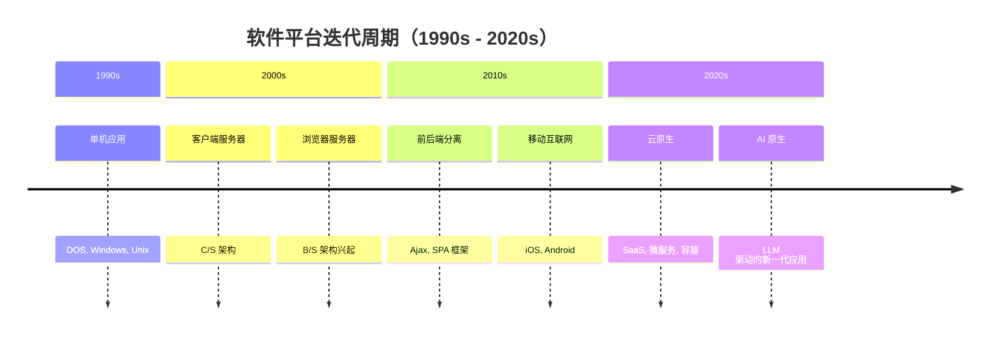

# 过度设计的隐性代价：为什么系统的终结者是平台迁移，不是烂代码

你有没有遇到过这样的场景：团队开会讨论架构，大家聊SOLID原则聊得头头是道，聊接口隔离、依赖倒置，说得很对，也很好听。可回到各自的任务，还是按老样子写。没人觉得有什么问题。

这是纪律问题吗？是态度问题吗？

我不这么认为。工作了近三十年，我见过很多认真的工程师，他们不是不懂设计，也不是懒得做设计。但那些规范就是落不了地。我一直觉得这背后有一个更根本的原因——只是很少有人把它说清楚。

---

## 软件工程借错了时间尺度

1968年，北约在德国召开了一次会议，第一次正式提出"软件工程"这个概念。那个年代，软件开发的规模越来越大，却缺乏系统性的方法论，于是工程师们向最成熟的工程学科借鉴——土木工程。

这个借鉴很自然，也很有成效。结构化设计、模块分解、文档规范……许多土木工程的思维方式被移植过来，软件的质量和可维护性都有了显著提升。

但土木工程有一个隐藏的前提，我们在借鉴时没有一起带进来：**建筑是用来用很久的**。

一座桥梁的设计寿命是50到100年。一栋楼从规划到退役，跨越几代人。在这个时间尺度下，前期投入大量工程精力，完全合理——回报周期足够长，任何细节的优化都有机会被反复用到。

软件工程在早期也是如此。大型主机系统动辄运行几十年，核心业务逻辑稳定而持久。那时候，按建筑工程的标准来设计软件，没有什么不妥。

但那是几十年前的事了。

---

## 7到10年，然后消失

我从事开发工作近30年，做过的项目大大小小，跨越了好几个技术时代。如果你问我，那些项目现在在哪里——大多数都消失了。

不是因为写得不好，而是因为时代变了。

每一次平台迭代，都淘汰了一批系统。不是某个系统写得不好，而是它整个赖以生存的环境消失了。

简单来说，这些系统退役的原因大致分三类：

**平台和架构的更替。** 从单机到C/S，从C/S到B/S，从B/S到云端SaaS。每一次迁移，旧系统不是被重构，而是被替换。之前的代码，不管设计得多扎实，都无法直接延续。

**技术栈的更迭。** WebForms消失了，取而代之的是Ajax引发的前后端分离，再之后是各种SPA框架。XML/SOAP被JSON/REST替代。通信技术从2G到5G，应用的假设条件彻底不同。每一次，你上一个项目积累的"设计资产"，在下一个项目里往往从零开始。

**商业和组织的变化。** 公司倒闭，部门裁撤，产品方向转型。北电网络（Nortel）曾是全球最大的电信设备商之一，其墙上高悬的“99.999%可靠性”代表着一个时代的巅峰。然而，受制于技术路线的误判与激烈的商业竞争，公司在裁撤我所在的 UMTS 部门并孤注一掷 CDMA 后，仍未能突围，于 2009 年宣告破产。数千名工程师多年凝聚的系统与核心代码，就此烟消云散。回望过去，企业的兴衰生死，终究与技术路线的演进迭代紧密相连。

仔细看，这三类原因和代码质量都没有关系。有一个共同点：**它们都发生在代码之外。**

---

## 系统死于商业变局，不死于代码质量

从技术角度看，这些系统的退役令人惋惜。从商业角度看，却是再正常不过的结果。

平台更替带来的不只是技术上的迁移，更是运营成本结构的剧变。当一个旧系统的维护成本远超它能带来的商业价值，或者新平台上的竞争者以更低的成本提供更好的体验，旧系统的命运就已经注定了——无论它的内部设计多么优雅。

诺基亚的手机是个好例子。诺基亚的硬件质量在功能机时代无人能及，做工扎实，信号稳定，摔不坏。然后智能机时代到来，它被随随便便一个杂牌 Android 手机碾压。不是因为诺基亚的质量变差了，而是用户的需求已经彻底不同了。质量，在错误的平台上，是没有意义的。

软件系统也是如此。当用户不再使用你的旧系统，或者公司无法忍受系统的效益/成本比，这个系统就必须退役。

我有一台十年前的台式机，主板上还设计了两个 DDR3 内存插槽，可以继续扩展。设计很周到，考虑了未来的升级需求。但它早就被放在角落里吃灰了——它的瓶颈不是内存，是整个时代都变了。

当年那些系统也是如此。苦心孤诣设计的冗余接口、精心规划的扩展点、为未来兼容性留下的抽象层……到系统退役的那一天，大多数根本没有被用上。

**各种良好的设计，最终都成了摆设。**

---

## 几个值得停下来想想的问题

一个系统如果生命周期只有七年，那它在第三年、第五年做的那些“为了以后好扩展”的设计，真的有意义吗？这些研发成本是不是被浪费了？

很多时候，搞死系统的不是代码烂，而是战略调整、业务转型、或者换了架构。如果决定系统寿命的根本不是代码本身，那我们天天卷“面向未来的代码设计”，到底是在解什么题？

我们必须反思：很多所谓的“正确投入”，本质上不是因为业务需要，而只是为了满足我们所谓的“技术洁癖”和工程情怀。

这几个问题，我们可以慢慢想，不急着要一个答案。

当然，有些设计实践是例外，它们在系统活着的每一天都有实实在在的回报：可读性让下一个人不用猜谜，可测试性让每次变更都有信心，清晰的领域模型让业务逻辑不藏在技术层里。这些从来不是问题，也不应该是妥协的对象。

但这和"为一个可能永远不会到来的需求预先设计扩展点"，是两件完全不同的事。

---

## 尾声

也许，那些"聊起来都觉得好，做起来自动忽略"的设计规范，不全是纪律问题。也许工程师们的直觉里，隐约感知到了什么，只是说不清楚。

软件工程这门学科还很年轻。1968年才刚刚命名，到现在不过半个多世纪。它借鉴了土木工程，借鉴了制造业，但软件本身的特性——它迭代的速度，它消亡的方式，它与商业的紧密程度——和这些先辈学科都不太一样。

也许我们还在摸索，哪些东西是真正属于软件自己的。
