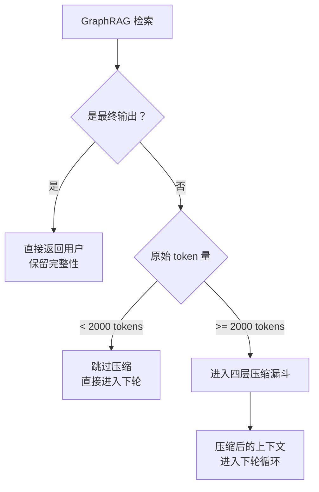
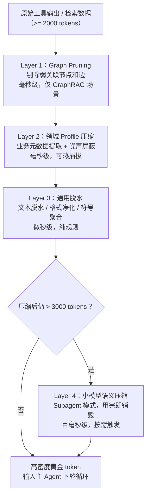

# 时空双引擎 Agent：用四层压缩漏斗让通用 Agent 又快又省

## 引言

RTK 和 CodeGraph 最近在 AI 工程社区里连续刷屏。火的原因很实在——它们直接戳中了 coding agent 的两处真实痛点。

以 Claude Code 为例。当 agent 需要理解一个陌生代码库时，最朴素的做法是用 bash 工具跑 `grep`、`find`、`cat`：每次只能拿到一批原始文本，信噪比极低，有用信息往往淹没在大量无关代码里。更糟的是，一次搜索几乎从来不够——agent 需要反复调用工具，结果拼图式地拼出全貌，循环次数轻松破十。每一轮都在烧 token，每一轮都在拉长响应时间。

**CodeGraph** 从「时间」维度切入：预先把代码库解析成符号调用图（symbol call graph），agent 查图就能直接拿到「函数 A 被哪些模块调用、依赖哪些接口」——一次查询替代原本需要 3-5 次 bash 工具调用才能拼出的信息全貌，大幅减少 agent 循环轮次。

**RTK（Real-Time Kompressor）** 从「空间」维度切入：拦截每次工具调用返回的原始输出，实时压缩截断，把 4000 token 的 bash 输出萃取成几百 token 的结构化关键信息，单次 token 消耗直降 60-90%。

两者叠加，效果是复利式的——循环少了，每轮 token 又省了，总成本可以降到原来的 15% 以下。

---

问题来了：**这套思路只适用于 coding agent 吗？**

当我们把 agent 推向大型企业级知识库，或者非编码的垂直领域——法律合规、医疗病历、多源财务审计——同样的两堵墙依然存在：数据库查询、API 调用、文档检索同样会返回海量噪声，多跳推理同样会触发频繁工具调用。只是这里没有代码符号图，没有 bash 输出，换了一套介质。

本文将 RTK 和 CodeGraph 的底层思想移植到**通用 Agent**，提出一个「时空双引擎」架构：**第一引擎**用 GraphRAG 从检索源头减少工具调用次数（对应 CodeGraph）；**第二引擎**用四层压缩漏斗在每轮循环中削减 token 噪音（对应 RTK）。

---

## RTK + CodeGraph：时间与空间，两个维度的优化

| | RTK | CodeGraph |
|---|---|---|
| **核心定位** | 数据压缩层 | 知识索引层 |
| **解决痛点** | 空间：单次工具输出噪声太大 | 时间：Agent 频繁盲目调用工具 |
| **核心手段** | 实时拦截并压缩 bash 输出，结构化截断 + KV 提取 | 预建代码符号调用图，Agent 查图替代跑命令 |
| **效果** | 单次 token 消耗降低 60-90% | Agent 循环轮次降低 2-10 倍 |

两者的共同洞察是：

> **LLM 不需要看原始数据，它需要看「对它有用的信息」。**

结合效果是复利式的：假设 CodeGraph 把 10 轮循环压到 5 轮，RTK 把每轮 token 从 4000 降到 1200，组合后的消耗是原来的 **15%**，而不是两者各自节省比例的简单相加。

---

## 双层架构：先减少工具调用，再决策是否压缩

把这套思路移植到通用 Agent，bash 命令换成了数据库查询、API 调用、文档检索——「知识图谱」应该建在哪里？答案是 **GraphRAG**。

### 第一引擎：GraphRAG 减少工具调用

传统向量 RAG 擅长「找语义相近的片段」，但在复杂关系查询上力不从心。比如「找出所有与客户 A 有关联的合规风险条款」，向量检索会返回一堆孤立的文本块，Agent 还得自己跑多次工具调用去串联关系。

GraphRAG 在索引阶段把文档拆解成**实体关系图**和**社区摘要**。检索时不只返回相似片段，还返回实体的上下游关联节点和所在社区的聚合摘要。**一次检索能替代原本需要 3-5 次工具调用才能拼出的信息全貌**——这正是 CodeGraph 思想在通用域的对应物。

### 第二引擎：压缩决策门

GraphRAG 检索完数据，不要急着全部塞进上下文。先问一个问题：**当前循环是不是最后一步？**



两个关键设计决策：

1. **最终输出不压缩**：给用户看的内容保留完整性，压缩收益只发生在中间循环。
2. **Gatekeeper 动态门槛**：如果原始数据本就很少（< 2000 tokens），压缩的开销大于收益，直接跳过。

---

## 四层压缩漏斗

通过了压缩决策门的数据，进入四层串联管道。越往后越「聪明」，也越贵——实践中可根据实际 token 量按需启用。



### Layer 1：Graph Pruning（图剪枝）

仅在使用 GraphRAG 时启用。GraphRAG 返回的子图包含大量边缘节点，并非都与当前任务相关。基于节点权重（PageRank / 度中心性）过滤弱关联边和边缘节点，只保留核心「实体-关系-实体」因果链。

- 工具：NetworkX 图过滤 / GraphRAG 自带 pruning API
- 典型效果：减少 30-50% 的原始文本量，完全不涉及语义判断，速度极快

### Layer 2：领域 Profile 压缩

针对特定行业定制，是四层中最需要开发投入的，也是 ROI 最高的一层：

| 场景 | 保留 | 丢弃 |
|---|---|---|
| 金融合规 | 金额、日期、交易对手方、条款关键词 | 格式声明、风险警示套话、免责声明 |
| 法律 | 当事人、日期、法条引用、判决结论 | 程序性陈述、引述格式头尾 |
| 客服 | 客户诉求、订单号、时间节点、处理结论 | 问候语、固定话术 |

实现：**规则引擎（正则）+ 小型 NER 模型**。设计为可热插拔——换个 profile 配置，换个行业，无需改代码。

### Layer 3：通用脱水

纯规则处理，不依赖行业知识：

- **文本脱水**：删除冗余连接词（「此外」「值得注意的是」）、重复表述
- **格式净化**：移除 markdown 装饰符、多余空白、HTML 残留
- **符号聚合**：`1, 2, 3, 4, 5` → `[1-5]`；长 URL → `[URL_1]`（原文缓存备查）

参考工具：LLMLingua（基于困惑度的 token 级压缩）或自定义 regex pipeline。

### Layer 4：小模型智能压缩（Subagent 模式）

前三层处理结构性噪声，但语义层面的冗余（同一意思的多种表达、与当前循环无关的背景解释）需要真正理解语言才能处理。

**选型原则**：推理极快、token 极廉价、上下文窗口 ≥ 32K。  
**候选模型**：Qwen2.5-7B-Instruct、Phi-4-mini、Gemma-3-4B。

**工程约束**：

1. 作为**独立 subagent** 启动，只做压缩这一件事
2. 任务完成后**立即销毁**，不与主 agent 共享对话历史——这是防止上下文污染的硬性要求
3. Prompt 极简，不给模型「发挥空间」：

```
你是信息提纯器。将以下内容压缩为核心信息，保留所有关键事实和因果依赖，
去除所有冗余表述，严禁添加修饰词：

{text}
```

经过前三层后再由小模型精简，最终压缩率可达 **5-10x**。

---

## 工程防线：防止过压缩

四层漏斗有一个风险：某层压缩不小心裁掉了「看似废话、实则关键」的信息，导致主 agent 推理出错后反复重试——反而增加了循环次数。

### 防线：Expand on Demand（按需展开）

每段经过压缩的数据在交给主 agent 时，附带一个唯一的 `context_id`，原始未压缩文本缓存到本地 KV 存储（Redis 或内存字典）。同时给主 agent 注册一个工具：

```python
def get_raw_output(context_id: str) -> str:
    """当压缩后的上下文出现逻辑断层或需要核实原始细节时调用"""
    return cache.get(context_id)
```

在系统提示词中告知主 agent：

> 你当前读取的是经过压缩的数据。如果推理过程中出现逻辑断层或需要核实细节，可以调用 `get_raw_output` 查看原始内容。

这个设计让压缩成为**可逆的**——主 agent 永远有「追溯原文」的能力，压缩策略可以更激进而不用担心破坏性损失。

---

## 适用场景与局限

**适合**：
- 长任务 Agent、多轮工具调用（文档分析、多源数据汇总）
- 信息密集型检索（法律文书、金融报告、技术文档库）
- 有明确行业属性、可定制 Layer 2 Profile 的垂直 Agent

**不适合**：
- 简单单轮问答（Gatekeeper 会直接跳过，但如果系统里根本不会有长输出，引入这套架构本身就是过度工程）
- 实时性要求 < 500ms 的场景（Layer 4 的小模型推理会引入额外延迟）

**监控建议**：在每层记录 `token_in` / `token_out`，用 OpenTelemetry 追踪压缩率与答案质量的 tradeoff。如果某层压缩导致答案质量下降，先**关闭该层**而不是调参——分层设计的核心价值就在于可以独立降级。

---

## 结语

时间瓶颈（循环次数）和空间瓶颈（token 过载）是通用 Agent 在复杂任务中最常见的两类性能问题，但它们往往被混为一谈，用同一种方式处理。

时空双引擎架构把两者解耦：GraphRAG 专门对抗时间瓶颈，四层压缩漏斗专门对抗空间瓶颈，Expand on Demand 防线保证压缩的可逆性。

更重要的是一个心智模型的转变：

> **Agent 是一条流水线，压缩是流水线中的一个 stage，不是 LLM 的副业。**

把「让 LLM 自己总结」替换成「流水线里的专用压缩 stage」，Agent 的行为开始变得可预测、可监控、可调试。

