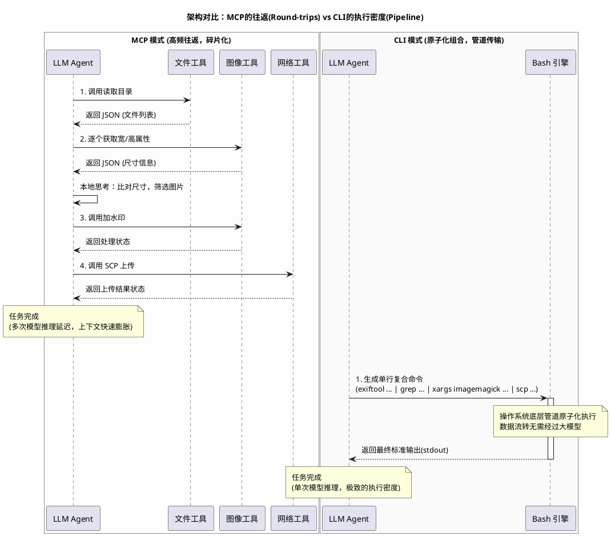
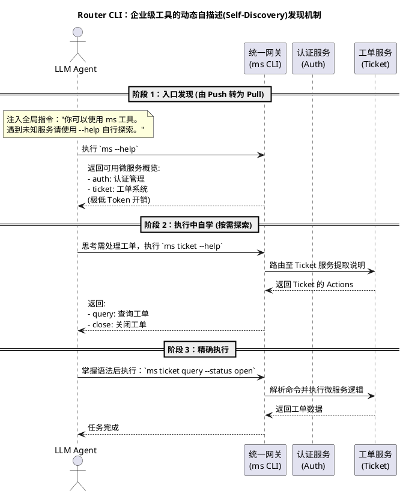

超越 MCP：为什么 CLI 正在重塑大模型时代的微服务编排

随着 AI Agent 从简单的交互式聊天助手，逐步演进为能够独立处理复杂任务的工程实体，我们正面临着一次底层基础设施的重构。在这个过程中，Model Context Protocol (MCP) 曾被寄予厚望，它试图建立一种大模型与外部工具交互的通用标准。从架构设计的 FURPS+（功能性、易用性、可靠性、性能、可支持性）维度来看，MCP 在互操作性和可支持性上无疑交出了一份优秀的答卷，它优雅地解耦了 Agent 的逻辑层与底层工具的实现细节。

然而，当我们将视角从理想的实验室环境切换到高并发、多微服务的企业级工程实践中时，MCP 的某些结构性瓶颈开始显现。这不仅引发了业界的广泛反思，也促使许多顶尖开发者和技术团队重新将目光投向了古老而强悍的命令行界面（CLI）。

### “上下文熵增”：JSON Schema 的不可承受之重

MCP 协议的核心运转机制，高度依赖于详尽的 JSON Schema。每次调用工具前，系统必须将工具的名称、描述、所有参数的类型、约束条件等元信息，完整地作为上下文注入给大模型。从高级架构师的角度来看，这是一种极其沉重的“静态预加载”负担。

随着接入工具数量的增加，这种预加载会导致严重的“上下文熵增”。这其中最直接的痛点是**Token 税（Token Tax）的经济学与性能考量**。每引入一个新工具，上下文窗口就会被永久性地侵占数百乃至上千个 Token。

更为隐蔽且致命的是**认知负载（Cognitive Load）与注意力分散**问题。Transformer 架构的注意力机制（Attention Mechanism）会随着输入序列的拉长而自然稀释。当我们强迫模型在进行核心逻辑推理之前，先去解析和消化海量的 JSON 结构定义时，模型的信噪比会急剧下降。这直接导致了模型在处理复杂任务时的“指令遵循能力（Instruction Following）”出现明显退化——它可能在浩如烟海的参数定义中，遗忘了最初的业务目标。

### 规模化实战中的上下文预算耗竭

为了更直观地说明这个问题，我们可以审视一下当前企业级应用中典型的微服务阵列。

在我们的实际业务域中，通常包含十几个核心微服务，平均每个微服务暴露七到八个关键的 API 端点。如果我们再将研发管线中的生态工具（如 GitHub、Azure、Atlassian 等）纳入 Agent 的能力矩阵，整个系统的可用工具集将轻易突破 100 个大关。

如果在 MCP 架构下将这 100 多个工具的 JSON Schema 全部暴露给大模型，粗略计算，单次请求的上下文占用可能高达 1.5 万到 2 万个 Token。这不仅意味着极其高昂的 API 调用成本，更严重的是，它几乎耗尽了我们为模型预留的“上下文预算（Context Budgeting）”，使得 Agent 无法在多轮对话中保持长效记忆，系统扩展性被彻底锁死。

### 行业的范式转移：回归 CLI

这种由于过度工程化带来的摩擦力，正在促使行业发生悄然的范式转移。最近，Plex 的 CTO 在开发者大会上公开表示，其内部工具链正在全面转向 API 和 CLI，逐步放弃 MCP；Y Combinator 的高层也表达了对 CLI 模式的青睐。而近期在开发者社区爆火的 OpenClaw（以及类似开源项目），在实际执行复杂任务时，几乎全盘采用了 Bash 环境和内部 CLI 命令。

CLI 究竟凭借什么优势，能够在 AI 时代完成如此漂亮的逆袭？

#### 优势一：利用“内生知识库”实现零熵集成

对于公共生态域的工具，CLI 拥有 MCP 无法比拟的先天优势。诸如 Azure CLI、GitHub CLI (`gh`)、Kubernetes (`kubectl`) 等业界标准工具，其语法和使用范例早已深度浸透在大模型的预训练语料库中。

这意味着，对于这些公共 CLI，大模型具备强大的“内生先验知识”。我们完全不需要向模型描述 `kubectl get pods` 的工作原理，这是一种“零熵”描述。CLI 在这里提供了一种高度压缩的符号化接口，模型只需输出极简的指令符号，就能调动庞大的底层能力。这种“符号压缩”不仅将 Token 成本降至冰点，更有效提升了模型的逻辑聚焦度。

#### 优势二：组合爆炸与极高的执行密度

在系统架构中，我们永远追求更高的执行效率。MCP 的一个显著劣势在于其碎片化的执行链路。

以下面的时序图为例，假设 Agent 需要完成一个复合任务：扫描目录中的照片、筛选出横板图片、添加水印，最后批量上传。

在 MCP 模式下，大模型被迫成为一个事无巨细的“微观调度员”。数据的每一次流转都需要回到模型进行反序列化、思考、再序列化发出。这需要极高的网络往返次数（Round-trips），拉长了系统的响应延迟。

而 CLI 借助于经典的 Unix 哲学，通过管道（Pipe）实现了工具的原子化组合。Agent 只需做一次深度思考，生成一行高密度的 Bash 复合命令，随后的数据过滤、状态流转全部在底层操作系统高速闭环完成。这种**逻辑执行密度**是 MCP 难以企及的，它大幅度降低了对 LLM 的请求次数。

### 私有微服务阵列的破局思路：Router CLI 架构

分析到这里，我们会面临一个不可回避的工程挑战：公共 CLI 虽然好用，但我们的企业内部有上百个私有微服务，大模型在预训练时根本没见过这些私有工具。如果我们将所有私有 CLI 的用法手册全部塞进 Prompt，岂不是又回到了 Token 耗竭的老路？

为了解决这个企业级难题，我们可以引入 **Router CLI（中转路由）** 架构，并配合 **动态自描述（Self-Discovery）** 机制。

我们可以将所有杂乱的微服务 API，收敛为一个统一的内部命令行入口（例如命名为 `ms`），并遵循标准化的语法范式：
`ms <service-name> <action> --option1 value1 --option2 value2`

这一架构的精妙之处在于，它完成了一次关键的范式转移：从 MCP 时代的**“强推模式（Push）”**（提前把所有 Schema 强塞给大模型），转变为 CLI 时代的**“按需拉取模式（Pull）”**。

在系统初始化时，大模型只知道一个极其简单的指令——遇到问题，执行 `ms --help`。在实际任务执行中，Agent 会像一个真实的高级工程师一样，通过查看帮助文档来进行“执行中自学（In-Execution Learning）”。它根据当前任务的目标，一层一层剥开需要的服务文档。这种设计以极小的 Token 开销为代价，换取了近乎无限的企业级工具扩展能力，彻底斩断了服务数量与上下文膨胀之间的必然联系。

### 结语

不可否认，MCP 仍有其不可替代的应用场景。正如相关技术研讨中指出的，在对安全合规和稳定性要求极度苛刻的多租户云端环境中，MCP 那种严格受限、高度结构化的调用方式，能够有效防止 RM -RF 等毁灭性风险。

然而，在追求极致运转效率、处理高并发企业级微服务调度的场景中，CLI 凭借其零熵的先验知识调用、原子化管道的执行密度，以及结合 Router 架构带来的动态自发现能力，正在重新定义大模型操作系统的效率基准。

作为架构开发者，我们不应拘泥于某种特定的协议标签。在设计 Agent 工具链时，尽可能地复用公共 CLI 基础设施，并通过中转路由模式重塑私有服务的接入层，是在当下 Token 经济学和模型能力边界内，构建高扩展性、低认知负载 AI 系统的最优解。
