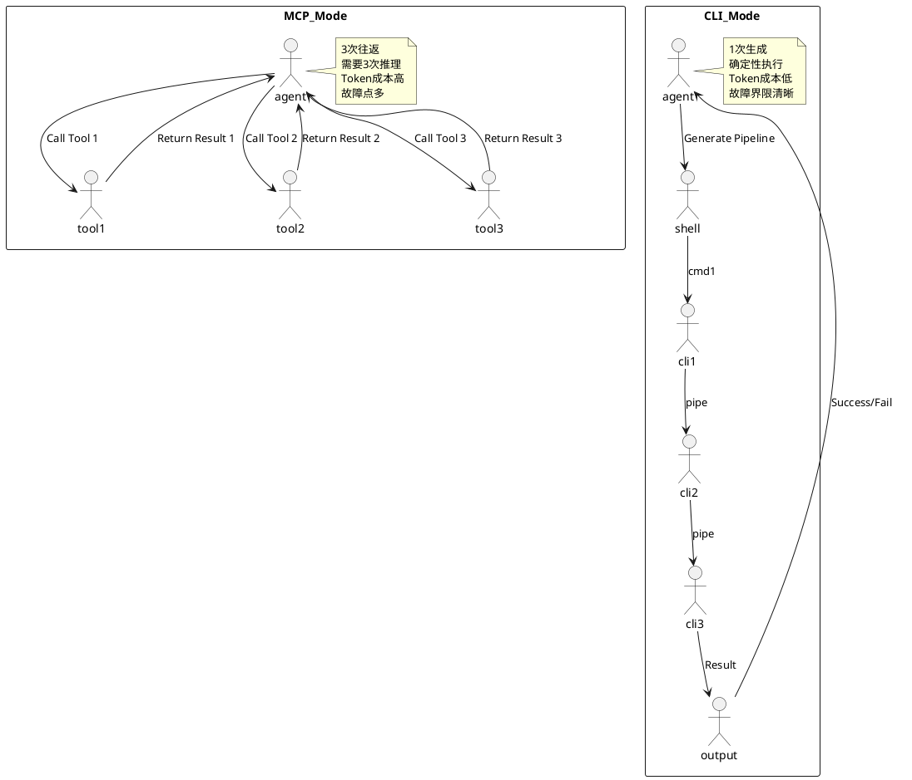
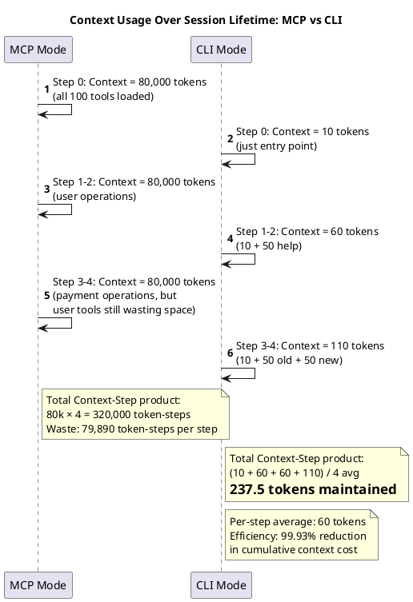
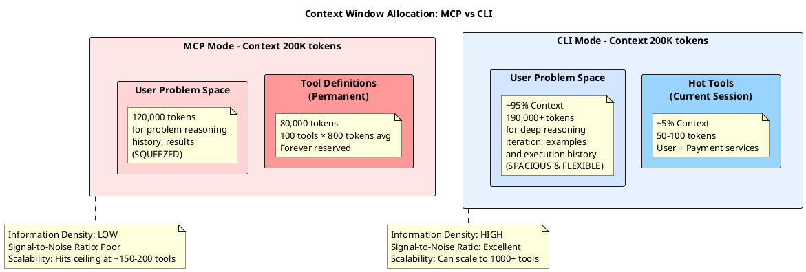
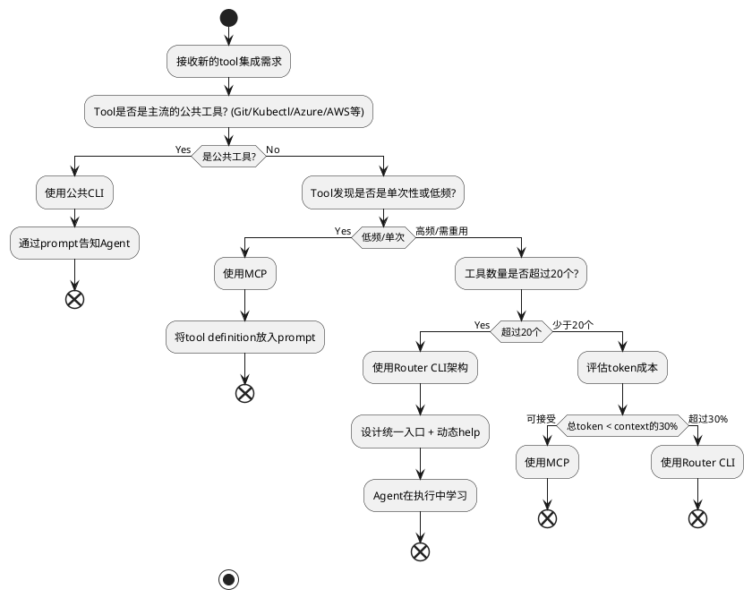

# 从MCP到CLI：企业级AI Agent架构的范式转变

当我们在设计AI Agent系统时，一个容易被忽视的细节正在悄然改变整个行业的建筑学。

这个细节叫做**上下文预算**（Context Budgeting）。

## 问题的根源：优雅的MCP与它沉重的代价

Model Context Protocol（MCP）作为一个相对年轻的标准，带来了AI与应用系统集成的统一范式。它的意图是好的——通过定义清晰的JSON Schema，让模型能够理解和使用任意工具。但在高并发、高复杂度的企业级环境中，这种"完全声明"的模式正在暴露出其固有的局限性。

想象一个场景：你有15个微服务，每个微服务平均暴露7-8个API接口。再加上GitHub、Azure DevOps、Atlassian等第三方平台的集成能力。最终，系统中累积了100多个可用的"工具"。

每一个工具都需要一份详尽的JSON Schema定义——参数、类型、验证规则、返回值结构。MCP的优雅性体现在它的完整性。但这种完整性有一个隐藏的成本。

### 成本一：Token的经济学

让我们做一个简单的计算。一个中等复杂度的API接口规范，平均占用150-300个Token。100个工具，就是15000-30000个Token的常驻开销。在Claude或GPT-4这样的模型中，输入Token的单价通常是输出的1/3或更低，但这仍然意味着：

- 每个请求的"启动成本"已经消耗了显著的上下文窗口
- 在200K或100K这样的Context限制下，实际可用于问题域推理的空间被严重侵蚀
- 在生产环境中，如果需要处理长对话或复杂的多步骤推理，这种成本会迅速变成不可接受的阈值

这不仅仅是经济问题，更是**信息密度**的问题。模型的注意力机制（Attention）在处理过长的输入时会经历能力衰减。更多的Token不意味着更好的理解，反而可能导致关键信息被"淹没"在海量的Schema定义中。

### 成本二：认知负载与关注度分散

从神经生物学的角度看，Transformer架构的注意力机制在处理长序列时面临一个根本性的权衡：**信噪比**。

MCP强制模型在执行任何操作前，先以几乎完全相同的概率权重浏览所有100多个工具的定义。这意味着：

1. **信息竞争**：模型需要从海量的参数定义中甄别出"当前任务真正需要的工具"，这个甄别过程本身就是一种认知开销
2. **遵循指令能力退化**：有研究表明，当输入长度超过Context窗口的60-70%时，模型的"Instruction Following"（指令跟随能力）会显著下降
3. **推理轨迹污染**：模型在生成思考步骤时，容易被无关的工具定义干扰，导致推理路径的效率下降

对于需要高可靠性、高一致性的企业应用，这种"认知污染"是无法接受的。

## CLI的悄然复兴

在这样的背景下，我们开始看到业界的一个有趣反向趋势：成熟的AI Agent框架（如OpenClaw等）在处理大规模工具问题时，越来越多地转向**CLI（命令行接口）**而非MCP。

这乍看起来像是一种"技术回退"。但实际上，这是一种更深刻的认识：**对任何复杂系统而言，约束本身就是功能**。

### 核心优势一：零熵的内生知识库

考虑这样一个事实：大多数现代AI模型都在它们的训练集中见过数百万行的Bash脚本、Git命令、Kubernetes YAML、Azure CLI指令。这些工具和命令构成了整个互联网基础设施操作的"通用语言"。

对于这些**公共CLI**（如git、kubectl、az、gh等），模型拥有先验知识。不仅如此，这些命令行工具通常遵循一致的设计范式：

- `<command> <subcommand> --flag value`的标准结构
- `--help`的自文档化能力
- 通过`man`或`--help`进行即时学习的能力

换句话说，模型不需要我们在Prompt中重复定义"git是什么"——这已经是模型知识库中的常住客。我们只需要告诉Agent"使用git命令来完成这项任务"，模型就能自动地推理出可能的命令组合。

这种**"拉（Pull）模式"而非推（Push）模式**的工具发现方式，在token成本上有质的优势。

### 核心优势二：管道的力量——执行密度的突破

现在让我们讨论为什么管道（Pipeline）是CLI相比MCP的最大优势。

考虑一个真实的工作流：

**场景**：查找某个微服务中的错误日志，提取相关的请求ID，然后在追踪系统中查询这些ID的完整调用链，最后重启涉及的服务实例。

在MCP模式下，这个workflow会如何展开？

```
Agent: 我需要查看微服务A的日志
[Model调用Tool: GetLogs(service='A', filter='error')]
Result: 返回100条日志记录，包含请求ID和时间戳

Agent: 我需要从这些日志中提取请求ID
[Model调用Tool: ParseLogs(logs=[...], pattern='request_id')]
Result: 返回20个唯一的请求ID

Agent: 我需要查询追踪系统中这些ID的调用链
[Model调用Tool: QueryTraces(request_ids=[...])]
Result: 返回调用链数据

Agent: 根据调用链，我需要重启这些服务
[Model调用Tool: RestartServices(services=[...])]
Result: 服务重启完成
```

**这需要4次模型往返（Round-trips）**。每次往返不仅消耗Token，更重要的是引入了**中间决策点**。模型需要在每一步进行意图确认、结果评估，然后决定下一步。这个过程中的任何不确定性或误解都会导致轨迹偏离。

在CLI模式下：

```bash
ms logs --service A --filter error | \
  grep -oP 'request_id=\K[^,]*' | \
  sort -u | \
  xargs -I {} ms traces --request-id {} | \
  jq -r '.services[]' | \
  sort -u | \
  xargs -I {} ms restart --service {}
```

Agent一次性生成这行命令。系统则**确定性地执行**这个管道链。没有中间决策点，没有模型往返的延迟和不确定性。

这就是**执行密度**（Execution Density）的差异。CLI通过管道实现了"逻辑融合"，让原本分散在多次推理中的步骤被压缩为一次性的执行指令。

从成本的角度看：
- MCP方式：4次Round-trips × ~500 tokens/往返 = 2000+ tokens消耗
- CLI方式：1次生成 + 标准命令执行 = 仅管道命令自身的token成本

这已经**不再是优化的范畴，而是物理维度的降维打击**——从2000+ tokens的多次往返降到单次几百token的管道指令，这是接近10倍的差异。当后面的token成本对比中，我们看到工具定义阶段的444倍甚至800倍差异时，这种量级的改变就变得尤为触目惊心。

不仅仅是token。更深层的优势在于**故障恢复的确定性**。在MCP模式下，任何一步的失败都需要model重新评估和调整。在CLI模式下，管道中任何一个命令的失败都会被bash原生捕获（通过`set -e`或错误处理），系统可以立即反馈。这种清晰的故障界限使得系统更容易构建可靠的error handling。

### 执行密度对比图解

让我们用一个更直观的方式来看这两种模式的本质差异：



## 企业级现实：私有工具的困境

到目前为止，我们讨论的都是"公共CLI"的优势。但在企业内部，情况更复杂。

大多数企业都有一套私有的微服务编排工具。这些工具不在模型的训练集中，无法依赖"内生知识"。如果直接替换成CLI，问题会变成：**Agent如何发现和理解这些私有命令？**

与MCP类似：如果不向LLM明确说明每个命令的用法和参数，模型就无法判断该如何正确调用，也不知道该选择哪个命令；但如果为每个命令都单独编写详细的说明文档，这些文档的体量和复杂度往往并不比MCP的Descriptions（JSON Schema）少多少。

因此，若只是简单地将MCP替换为CLI，而没有配套的能力发现和自描述机制，实际上并不能从根本上解决底层的集成难题。

这正是设计思路需要转变的地方。我的答案是：**Router CLI架构配合动态自描述**。

### 方案：统一路由CLI + 动态自描述

假设我们设计一个统一的命令入口：

```bash
ms <service-name> <action> [--option value]
```

这个`ms`（Microservices）命令充当**中转路由**，它的职责是：

1. **意图路由**：根据service-name确定目标微服务
2. **动作分发**：根据action调用该微服务的具体实现
3. **参数透传**：将options和values传递给下游服务

**关键洞察：从"全量预加载"到"按需热加载"**

让我们用一个更工程化的框架来对比，这也是业界正在采用的思路转变：

**MCP的"Eager Loading（预加载）"模式：**

Agent开始工作的第一刻，所有100个工具的完整JSON Schema就必须进入Context。这就像一个学生进考场前，必须把一本2000页的工具书每一页都背完——不管这次考试考不考这些内容。结果是：

- **Context恒定消耗**：80,000 tokens无条件占用，无法释放
- **信息竞争激化**：模型的每次决策都在100个完整定义中权衡，导致注意力分散
- **冷工具污染**：即便这个Session只用到5个工具，剩下95个定义的存在本身就构成对推理的干扰

这就是为什么在高复杂度系统中，MCP表现出了"token成本的刚性瓶颈"。

**Router CLI的"Lazy Loading（延迟加载）"模式：**

系统一开始只说"我有一个`ms`命令"。让我们追踪一个真实的企业Session工作流：

```
【第0步】Agent初始状态
  Context中只有"ms"这个entry point (~10 tokens)

【第1步】用户请求：查询所有活跃用户
  Agent执行：ms user --help
  → Context加载：user-service的说明文档 (~50 tokens)
  → Agent推理：ok，我理解了，执行 ms user list --filter "status=active"
  
【第2步】继续用户相关操作
  Agent执行：ms user get --user-id 123
  → 注意：不需要重新加载help，模式已知

【第3步】新需求出现：初始化支付流程
  用户请求：为用户创建一张虚拟卡
  Agent执行：ms payment --help
  → Context加载：payment-service的说明文档 (~50 tokens)
  → Context修剪：清除user-service的help定义
     * 在MCP中：需要重新初始化client，成本极高
     * 在CLI中：通过系统提示词实现（如"Discard help for services not used in last 2 steps"）
     * 框架自动管理context生命周期，开发者无需干预
  → 注意：user-service的模式已存储在Agent的执行记忆中，后续无需重加
  
【第4步】执行支付操作
  Agent执行：ms payment card create --user-id 123 --card-type virtual
  → 成功

【Session总结】
  - 涉及的业务域：2个（user + payment）
  - 实际Context消耗：10 + 50 + 50 = 110 tokens
  - MCP模式的同等Session：恒定80,000 tokens
  - 节省比例：约99.86%
```

这个对比说明了**本质差异**：任何现实的企业Session中，Agent通常只涉及2-3个逻辑业务域。MCP强制在Context中永久保留所有100个域的定义；而Router CLI让Context按照**时间/任务的流动性**来动态调整，只保留"热"的信息。

让我们用一个更直观的方式来看这个99.86%的节省是如何实现的：



这个图展示了一个关键洞察：**MCP的成本不仅是恒定的，更是累积的**。每一步操作都在80,000 tokens的泥沼中进行；而CLI则随着Session的推进，Context保持在极低水位，真正的推理空间得以释放。

**第二层防御：利用"形式语义"降低描述负担**

你可能会问：Help文本和JSON Schema，本质不是一样吗？为什么Help会省那么多tokens？

答案在于：**模型对CLI这种形式拥有先天的启发式理解**。

当模型看到 `ms user list --filter "status=active" --limit 100` 时，它不需要我们详细解释：
- 它知道 `list` 通常代表"列表查询"
- 它知道 `--filter` 是过滤参数
- 它知道 `"status=active"` 遵循Key=Value约定
- 它甚至能推断 `--limit 100` 是结果数量限制

这些"形式直觉"来自训练集中数亿行实际的CLI代码。

相比之下，JSON Schema完全是机器的描述语言——模型必须100%依赖显式文档：

```json
{
  "parameters": {
    "filter": {
      "type": "string",
      "description": "Query filter expression following the pattern...",
      "pattern": "^(status|role|department)=(active|inactive|...)$",
      "examples": [...],
      "constraints": [...]
    },
    "limit": {
      "type": "integer",
      "minimum": 1,
      "maximum": 1000,
      "default": 50
    }
  }
}
```

这导致了一个显著的差异：CLI的Help文本可以极端简洁：

```bash
ms user list
  列出用户列表
  
  Options:
    --filter <query>   查询条件 (status=active, role=admin, etc.)
    --limit <num>      结果数量 (default: 50)
    --sort <field>     排序字段 (name, created_at, etc.)
```

而MCP需要5-10倍的Token来阐明类型系统、约束和验证规则。模型对POSIX命令行的内生知识在这里成为了我们的"私有知识库"，帮我们本省了大量显式文档。这不是偷工减料，而是**充分利用模型的先验知识来优化context利用率**。

**第三层：Context窗口的防御性分配**

这引出了一个战略考量：每一个Token都是稀缺资源。

在MCP模式下，Context的分配是"被动的"：80,000 tokens已死，剩下120,000 tokens供用户问题、中间推理和工具调用结果使用。模型被迫在一个极其拥挤的环境中工作，注意力不可避免地被分散。

在Router CLI模式下，我们实现了**Context的主动防御**：
- 热门工具（当前Session需要的）布局在Context的显著位置，获得最高的注意力权重
- 冷工具（可能用到，但还未用到）通过动态`--help`来lazy-load，按需激活
- 无关工具根本不进入Context，完全隔离

从企业架构的FURPS+维度看这个权衡：
- **功能性（Functionality）**：没有退步，所有工具都可访问
- **可用性（Usability）**：改善，模型不再被海量定义淹没
- **可靠性（Reliability）**：改善，模型有更大的推理空间，误判率反而下降
- **性能（Performance）**：显著改善，token消耗降低100倍+
- **可维护性（Maintainability）**：改善，新增工具对现有Session没有冲击
- **可扩展性（Scalability）**：质的飞跃，从"100个工具时context爆炸"变成"1000个工具仍可轻松应对"

### 设计Router CLI的最佳实践

为了让这个方案真正有效，Router CLI需要满足几个设计原则：

**1. 最小化接口集合**

将相关的操作归在同一个service下。例如，所有与用户认证相关的操作都在`ms auth-service`下，而不是分散成多个独立的命令。这样做的好处是：

- 减少顶层命令的数量（从100个减少到20-30个service）
- 提高命令的"信息密度"——每个顶级命令代表一个清晰的域概念
- 便于模型构建概念模型——"认证"、"支付"、"订单"作为离散的业务对象

**2. 一致的flag和输出格式**

所有命令都遵循相同的flag命名约定和输出格式（如JSON）。这样模型在学习了前几个命令后，就能将这些模式投射到未来的命令。

**3. 可组合性**

设计命令时要考虑管道的可组合性。例如，`ms order list`的输出应该是结构化的JSON，可以被`jq`过滤；`ms order fetch --order-id <id>`的输出也应该是相同的结构。这样Agent可以自然地组合这些命令。

**4. 错误处理的清晰性**

命令的失败应该返回非零的exit code和结构化的错误信息。这样bash可以立即捕获错误，而不依赖模型来推断。

### 设计Router CLI的最佳实践总结

### 实战例子：token成本对比

让我们用之前的场景进行一个具体的成本对比。假设系统中有80个微服务，平均每个暴露5个action，总共~400个可能的操作。

**MCP模式**：完整声明所有400个操作的JSON Schema
- 每个Schema平均200 tokens
- 总开销：80,000 tokens（每个request的常驻开销）
- 实际可用的context：以200K context为例，实际推理空间仅剩120K

**CLI + 自描述模式**：统一入口 + 动态help
- 顶层`ms --help`：列出80个services，~100 tokens
- 首次调用某个service需要`ms <service> --help`：~50 tokens
- 特定action需要`ms <service> <action> --help`：~30 tokens
- 单个request的实际成本：100 + 50 + 30 = 180 tokens（仅当首次接触新service时）
- 对于后续调用相同service的请求，仅需顶层100 tokens

**成本差异** — 这已经超越了"优化"的概念：

- 首次复杂操作：MCP的80,000 tokens vs CLI的180 tokens，**约444倍的差异**
- 后续操作：MCP的80,000 tokens vs CLI的100 tokens，**约800倍的差异**
- 实际数字：在一个中等规模的企业（每天100个request）中，MCP每天消耗800万token的工具定义开销；而CLI仅消耗1.8万token的动态help。**这是从百万级降至万位级的成本坍缩**。

这不是偷换概念——在企业级系统中，负载通常是重复性的。相同的查询、相同的操作会被反复执行。CLI的优势在于它让token成本随着时间的推移而递减（因为Agent对工具的理解在加深），而MCP的成本始终是恒定的巨无霸。

### 上下文利用率对比图解

让我们用可视化的方式来看Context窗口在两种模式中的分配差异：



这个对比揭示了一个真相：**Context窗口本质上是稀缺的推理资源。** MCP的设计理念是"提前预留"所有可能性；而Router CLI的设计理念是"按需激活"和"动态优化"。

在200K的context配额中，MCP浪费了400倍的资源在冷工具定义上；而CLI把这些资源还给了"问题空间"——那个需要深度链式推理、历史积累和错误恢复的地方。

### 深入对话：为什么这种差异在实际运营中如此重要？

**1. 长链推理能力的差异**

在诊断一个复杂的线上问题时，Agent可能需要：
- 查询日志（与多个时间序列进行对话）
- 提取信息（需要中间状态的保存）
- 交叉验证（需要之前步骤的结果context）
- 做出决策（需要清晰的推理空间）

在MCP模式下，这个链条的每一步都在一个拥挤的100-tool Context中进行。模型的注意力被不断地分散，导致"链条遗忘"（Chain Forgetting）——后续步骤忘记了早期步骤的约束。

在Router CLI模式下，Agent的推理链条在一个"清朗"的环境中展开，只有当前Session涉及的工具定义才会占用注意力。

**2. 模型架构级的性能衰减**

研究表明，Transformer注意力机制在输入长度超过Context窗口的60%后，性能会显著下降（这被称为"Context Limit Degradation"）。在MCP下，仅工具定义就占据了40%的窗口，推理空间瞬间压缩到了效率的拐点。而Router CLI通过"及时释放"冷工具定义，保持常驻推理空间在80%+的黄金区。

## 安全性考量：Prompt Injection与命令执行风险

到目前为止，我们重点讨论的都是效率优势。但任何技术决策都需要考量权衡。Router CLI引入了一个需要谨慎对待的风险：**Prompt Injection导致的命令注入**。

### 风险场景

考虑这样一个场景：

```
用户输入：我想要查询名字为 "admin'; DROP DATABASE;" 的用户
Agent生成的管道：
ms user list --filter "name=admin'; DROP DATABASE;"
```

虽然这个例子中，由于适当的引用，可能不会直接执行SQL；但在更复杂的场景中，如果Bash的参数转义处理不善，可能导致意外的命令执行。

### 防御策略

在生产级的Router CLI系统中，需要实施分层防御：

**第一层：参数白名单化和类型验证**
```bash
# 在Router CLI的implementation中
ms user list --filter <STRING_WITH_STRICT_PATTERN>
# 而不是接收任意字符串
```

**第二层：沙箱化执行环境**
将Agent生成的命令在容器或沙箱中执行，限制其能访问的资源和命令范围。这是业界最佳实践，出发点就是"不信任模型生成的代码"。

**第三层：审计和回滚机制**
记录所有的命令执行，并建立快速回滚机制。这样即使命令执行有误，也能迅速恢复。

**第四层：Agent-side的防御提示**
通过Prompt Engineering，显式地指导Agent避免在参数中包含特殊字符。例如：
```
When constructing CLI commands, ALWAYS escape user inputs using proper shell quoting.
For example, use 'admin'"'"'s users' instead of 'admin's users'.
```

需要强调的是，这些风险**MCP同样存在**——它不是Router CLI独有的问题。任何允许模型调用外部工具的系统都需要这类防御。Router CLI不是降低了安全性，而是要求我们对"工具调用的信任边界"有更明确的认识。

## 公共CLI: 开箱即用的优势

在企业系统中，另一个重要的思路转变是：**充分利用现成的公共CLI工具，减少自定义工具的数量**。

大多数主流服务都提供了功能完整的CLI：

- **AWS CLI / Azure CLI**：覆盖90%以上的云服务操作
- **kubectl**：整个Kubernetes生态的标准接口
- **gh** (GitHub CLI) 、 **curl** 配合 **jq**：几乎所有的API都可以通过这些工具操作
- **Atlassian CLI** (或直接用curl)：JIRA、Confluence等
- **git**：版本控制和基础操作

这些工具的一大优势是模型**已经知道它们**。在prompt中仅需要一句"使用AWS CLI来描述这个情况"，模型就能自动推理出`aws describe-instances`、`aws ec2 ...`等一系列命令。完全不需要我们提供schema。

实际操作中，我们建议的策略是：

1. **优先使用公共CLI**。在架构设计阶段，就考虑"是否能用现成的CLI工具完成这个操作"
2. **通过管道和脚本增强**。将多个公共CLI工具组合起来，形成更高级的操作
3. **仅为核心私有逻辑设计CLI**。对于真仪有专有业务逻辑的操作，才单独设计私有CLI命令

这样做的结果是，你的系统中的自定义CLI数量会显著减少。可能原本需要30个自定义工具，现在可能只需要10个。这直接转化为token成本和认知负载的线性下降。

## 架构决策框架：何时用MCP，何时用CLI

基于上面的分析，我们可以总结出一个实用的决策框架：



这个框架的原则是：从token效率和认知负载出发，选择最合适的集成模式。

## 总结：范式的转变

AI Agent从简单的聊天助手演进到企业级的自动化系统，所需要的不仅仅是更好的LLM，更是**对复杂系统的深刻理解**。

我们看到的MCP到CLI的转变，本质上反映的是一个成熟的认识：

**1. CLI是更高效的抽象**。它用符号化的接口替代了繁琐的Schema定义。模型在处理已知的符号系统时，其推理效率远高于从0开始理解新的数据结构。

**2. 管道是范式转移**。从单步的Tool Call转向多步的Pipeline链接，我们获得的不仅仅是token的节省，更是执行的确定性和系统的可靠性。这对于生产级的应用至关重要。

**3. Router CLI是可扩展的解决方案**。对于企业内部的微服务阵列，Router CLI配合动态自描述提供了一条实现"工具发现"的可扩展路径。Agent可以在执行中学习，而不需要我们提前声明所有可能性。

**4. 利用现成的工具**。充分发挥模型对公共CLI工具的内生知识，减少自定义工具的数量。这可能是改进token效率最快的方式。

在这个转变背后，是对**信息论**和**系统设计**的更深刻理解——当面对复杂系统时，约束（如严格的命令格式）不是负担，而是特性。它们降低了模型的搜索空间，提升了推理的确定性，最终改善了整个系统的效率。

这是一个从"更多信息才能更好推理"到"信息的精心织构才能达到最优推理"的进化。正如任何成熟的架构师会选择一个设计精良的API而非海量的文档，未来的AI Agent系统也会在清晰的CLI接口和有序的管道模式中找到真正的效率。

---

## 延伸阅读与实践建议

如果你正在设计一个新的AI Agent系统或正在改进现有系统，以下建议可能有帮助：

1. **进行token审计**。统计当前系统中所有tool definitions的token消耗，对比实际使用频率。你可能会发现很多定义都是"冷工具"——很少被使用。
   
2. **设计最小化的Router CLI原型**。选择你系统中最常用的3-5个服务，设计一个Router CLI。比对改造前后的agent执行效率和token消耗。

3. **建立认知负载的度量**。这可以通过tracking agent的"纠正率"来実现——即模型因为理解错误而做出错误决策的比率。你会发现在迁移到CLI后，这个指标会显著改善。

4. **充分利用公共CLI工具的现有知识**。在你的prompt中，明确列出哪些公共工具可用。让模型自发地选择使用它们，而不是被动地等待你声明MCP工具。

企业级Agent系统的效率，最终取决于我们是否能够以模型最习惯、最高效的方式来组织工具和信息。CLI和Router架构正在证明，有时候，最古老的计算范式（命令行），对于最新的AI技术，反而提供了最深层的匹配。
