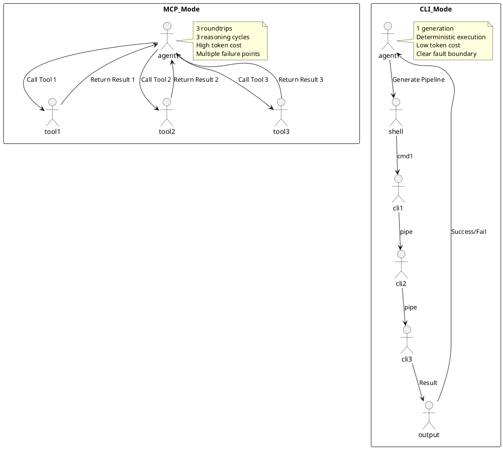
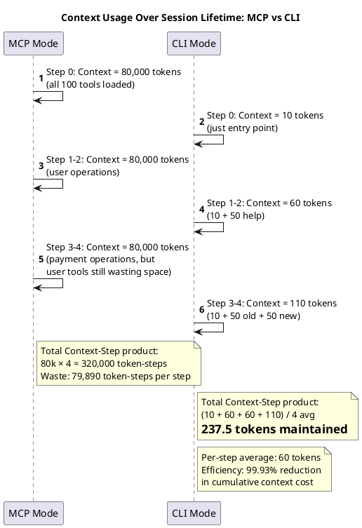
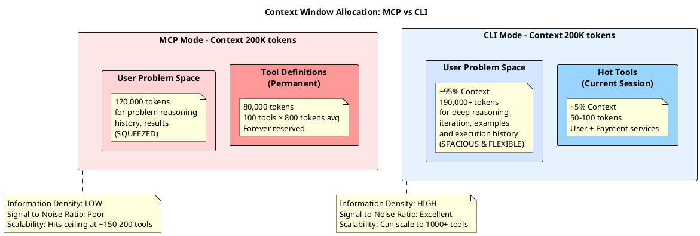
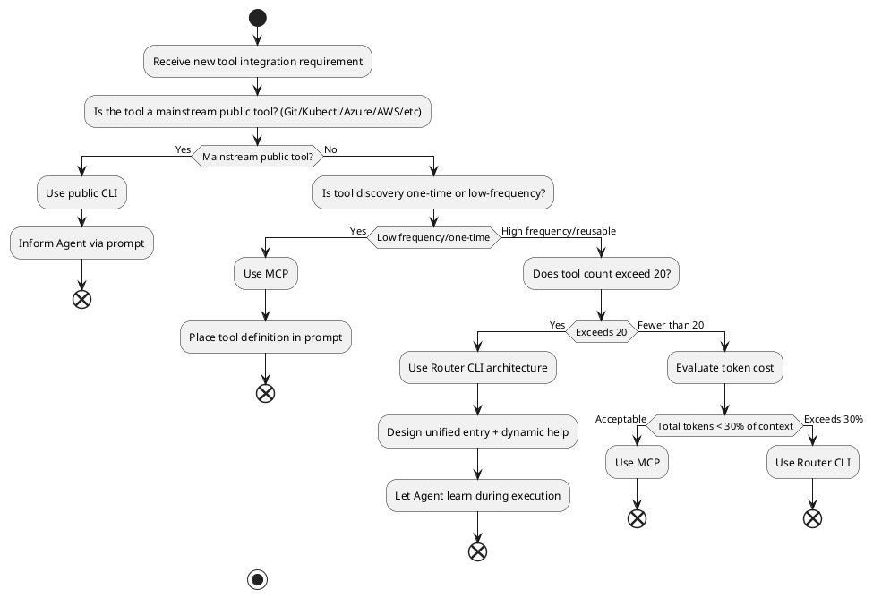

# From MCP to CLI: A Paradigm Shift in Enterprise-Grade AI Agent Architecture

When designing AI Agent systems, one overlooked detail is silently reshaping the entire industry's technical foundation.

This detail is called **Context Budgeting**.

## The Root Problem: The Elegance of MCP and Its Hidden Cost

Model Context Protocol (MCP), as a relatively young standard, introduced a unified paradigm for integrating AI with application systems. The intent is sound—by defining clear JSON Schemas, it enables models to understand and use arbitrary tools. However, in high-concurrency, high-complexity enterprise environments, this "complete declaration" approach is revealing fundamental limitations.

Picture this scenario: You have 15 microservices, each exposing 7-8 API endpoints on average. Add integrations with GitHub, Azure DevOps, Atlassian, and other third-party platforms. The result: 100+ available "tools" in your system.

Each tool requires a detailed JSON Schema definition—parameters, types, validation rules, return value structures. MCP's elegance lies in its completeness. But this completeness carries a hidden cost.

### Cost One: The Economics of Tokens

Let's do a simple calculation. A moderately complex API specification averages 150-300 tokens. For 100 tools, that's 15,000-30,000 tokens in standing overhead. With models like Claude or GPT-4, where input token pricing is typically 1/3 of output pricing, this translates to:

- The "startup cost" of each request has already consumed a significant portion of the context window
- Within 200K or 100K context limits, the actual space available for problem-domain reasoning is severely eroded
- In production environments handling long conversations or complex multi-step reasoning, this cost rapidly becomes unacceptable

This is not merely an economic problem—it's fundamentally an **information density** problem. The model's attention mechanism experiences capability degradation when processing extremely long inputs. More tokens don't mean better understanding; they risk burying critical information under mountains of Schema definitions.

### Cost Two: Cognitive Load and Attention Fragmentation

From a neuroscience perspective, the Transformer architecture's attention mechanism faces a fundamental trade-off when processing long sequences: **signal-to-noise ratio**.

MCP forces the model to browse all 100+ tool definitions with nearly identical probability weights before executing any operation. This means:

1. **Information Competition**: The model must distinguish "which tools truly matter for this task" from a sea of parameter definitions—a process that itself consumes cognitive resources.
2. **Instruction Following Degradation**: Research shows that when input length exceeds 60-70% of the context window, the model's "Instruction Following" capability drops significantly.
3. **Reasoning Trajectory Pollution**: When generating reasoning steps, the model is easily distracted by irrelevant tool definitions, reducing reasoning path efficiency.

For enterprise applications requiring high reliability and consistency, this "cognitive pollution" is unacceptable.

## The Quiet Renaissance of CLI

Against this backdrop, we're witnessing an interesting counter-trend: mature AI Agent frameworks (like OpenClaw) increasingly turn toward **CLI (Command Line Interface)** rather than MCP when handling large-scale tool problems.

This may look like "technical regression." But actually, it reflects a deeper insight: **For any complex system, constraints themselves are features**.

### Core Advantage One: Zero-Entropy Intrinsic Knowledge Base

Consider this fact: Most modern LLMs have encountered millions of lines of Bash scripts, Git commands, Kubernetes YAML, and Azure CLI directives in their training sets. These tools form the "lingua franca" of internet infrastructure operations.

For these **public CLIs** (git, kubectl, az, gh, etc.), models possess prior knowledge. Moreover, these command-line tools follow consistent design patterns:

- The standard `<command> <subcommand> --flag value` structure
- Self-documenting capability through `--help`
- Immediate learning ability via `man` or `--help`

In other words, the model doesn't need us to re-explain "what is git" in the prompt—it's already a resident in the model's knowledge base. We simply tell the Agent "use git commands to complete this task," and the model can automatically reason about potential command combinations.

This **"Pull Mode" rather than "Push Mode"** tool discovery has qualitative advantages in token cost.

### Core Advantage Two: Pipelines—The Breakthrough in Execution Density

Now let's discuss why pipelines are CLI's greatest advantage over MCP.

Consider a real workflow:

**Scenario**: Find error logs in a microservice, extract related request IDs, query the trace system for complete call chains of these IDs, then restart the affected service instances.

How would this unfold in MCP mode?

```
Agent: I need to view logs from microservice A
[Model calls Tool: GetLogs(service='A', filter='error')]
Result: Returns 100 log records with request IDs and timestamps

Agent: I need to extract request IDs from these logs
[Model calls Tool: ParseLogs(logs=[...], pattern='request_id')]
Result: Returns 20 unique request IDs

Agent: I need to query the trace system for these IDs' call chains
[Model calls Tool: QueryTraces(request_ids=[...])]
Result: Returns call chain data

Agent: Based on the call chains, I need to restart these services
[Model calls Tool: RestartServices(services=[...])]
Result: Services restarted
```

**This requires 4 model roundtrips**. Each roundtrip not only consumes tokens but introduces **intermediate decision points**. The model must confirm intent, evaluate results, and decide the next step at each stage. Any uncertainty or misunderstanding in this process can derail the trajectory.

In CLI mode:

```bash
ms logs --service A --filter error | \
  grep -oP 'request_id=\K[^,]*' | \
  sort -u | \
  xargs -I {} ms traces --request-id {} | \
  jq -r '.services[]' | \
  sort -u | \
  xargs -I {} ms restart --service {}
```

The Agent generates this command once. The system then **executes deterministically** through the pipeline. No intermediate decision points, no roundtrip delays or uncertainty.

This is the difference in **Execution Density**. CLI achieves "logic fusion" through pipelines, compressing steps scattered across multiple reasoning phases into a single execution instruction.

From a cost perspective:
- MCP approach: 4 roundtrips × ~500 tokens/roundtrip = 2000+ tokens consumed
- CLI approach: 1 generation + standard command execution = just the pipeline command's token cost

This is no longer in the optimization realm—**it's a physics-level dimensional reduction**—from 2000+ tokens of multiple roundtrips down to a single few-hundred-token pipeline instruction. This represents roughly a 10x difference. When we see 444x or even 800x differences in tool definition costs later, the magnitude of change becomes truly striking.

Beyond tokens, the deeper advantage is **deterministic failure recovery**. In MCP mode, any step's failure requires the model to re-evaluate and adjust. In CLI mode, any command failure is natively captured by bash (via `set -e` or error handling), providing immediate feedback. This clear fault boundary makes reliable error handling easier to build.

### Execution Density Comparison Diagram

Let's visualize the fundamental difference between these two modes:



## Enterprise Reality: The Challenge of Private Tools

So far, we've discussed advantages of "public CLIs." But within enterprises, the situation is more complex.

Most enterprises maintain proprietary microservice orchestration toolsets. These tools aren't in the model's training set and can't rely on "intrinsic knowledge." If we simply switch to CLI without proper discovery and self-description mechanisms, the problem becomes: **How can the Agent discover and understand these private commands?**

If we don't explicitly tell the LLM how each command works and what parameters it accepts, the model can't judge how to call it correctly or which command to choose. But if we write detailed documentation for each command, that documentation's volume and complexity often rivals what MCP's Descriptions (JSON Schema) would require.

Merely replacing MCP with CLI without accompanying capability discovery and self-description mechanisms doesn't fundamentally solve the integration challenge.

This is where design thinking needs to shift. My answer is: **Router CLI architecture combined with dynamic self-description**.

### Solution: Unified Router CLI + Dynamic Self-Description

Suppose we design a unified command entry point:

```bash
ms <service-name> <action> [--option value]
```

This `ms` (Microservices) command acts as a **central router** with clear responsibilities:

1. **Intent Routing**: Determine the target microservice based on service-name
2. **Action Dispatch**: Call the specific microservice implementation based on action
3. **Parameter Passthrough**: Forward options and values to downstream services

**Key Insight: From "Full Pre-Loading" to "On-Demand Hot Loading"**

Let's use a more engineering-focused framework for comparison—one the industry is adopting:

**MCP's "Eager Loading" Mode:**

The moment the Agent starts working, all 100 tools' complete JSON Schemas must enter Context. This resembles requiring someone to memorize every page of a 2000-page reference manual before taking an exam—regardless of whether the exam covers those sections. The result:

- **Constant Context Consumption**: 80,000 tokens occupied unconditionally, impossible to release
- **Intensified Information Competition**: The model's every decision involves weighing among 100 complete definitions, fragmenting attention
- **Cold Tool Pollution**: Even if the session only uses 5 tools, the remaining 95 definitions' mere presence constitutes reasoning interference

This is why MCP exhibits "token cost rigidity" in high-complexity systems.

**Router CLI's "Lazy Loading" Mode:**

The system initially just says "I have an `ms` command." Let's trace a real enterprise session workflow:

```
【Step 0】Agent initialization
  Context contains only the `ms` entry point (~10 tokens)

【Step 1】User request: List all active users
  Agent executes: ms user --help
  → Context loads: user-service documentation (~50 tokens)
  → Agent reasoning: OK, I understand. Execute ms user list --filter "status=active"
  
【Step 2】Continued user operations
  Agent executes: ms user get --user-id 123
  → Note: No need to reload help; pattern is known

【Step 3】New requirement emerged: Initialize payment flow
  User request: Create a virtual card for the user
  Agent executes: ms payment --help
  → Context loads: payment-service documentation (~50 tokens)
  → Context pruning: Remove user-service help definition
     * In MCP: Would require client re-initialization at huge cost
     * In CLI: Implemented via system prompt (e.g., "Discard help for services not used in last 2 steps")
     * Framework auto-manages context lifecycle; developers don't intervene
  → Note: user-service patterns remain in Agent's execution memory; no reload needed

【Step 4】Execute payment operation
  Agent executes: ms payment card create --user-id 123 --card-type virtual
  → Success

【Session Summary】
  - Involved business domains: 2 (user + payment)
  - Actual context consumption: 10 + 50 + 50 = 110 tokens
  - MCP mode for equivalent session: Constant 80,000 tokens
  - Savings ratio: ~99.86%
```

This comparison illustrates the **fundamental difference**: In any real enterprise session, the Agent typically operates within 2-3 logical business domains. MCP forces permanent retention of all 100 domain definitions in Context. Router CLI lets Context dynamically adjust according to **temporal/task flow**, preserving only "hot" information.

Let's visualize how this 99.86% savings is achieved:



This reveals a critical insight: **MCP's cost isn't just constant—it's cumulative**. Each operation occurs within an 80,000-token quagmire. CLI maintains context at extremely low levels throughout the session, genuinely liberating reasoning space.

**Second Layer: Leveraging "Form Semantics" to Reduce Description Burden**

You might ask: Aren't help text and JSON Schema essentially the same? Why does help save so many tokens?

The answer: **Models possess innate heuristic understanding of CLI form**.

When encountering `ms user list --filter "status=active" --limit 100`, the model doesn't need detailed explanation:
- It knows `list` typically means "query a list"
- It understands `--filter` is a filter parameter
- It recognizes `"status=active"` follows Key=Value convention
- It infers `--limit 100` restricts result count

These "form intuitions" derive from billions of lines of actual CLI code in training data.

By contrast, JSON Schema is purely machine language—the model depends 100% on explicit documentation:

```json
{
  "parameters": {
    "filter": {
      "type": "string",
      "description": "Query filter expression following the pattern...",
      "pattern": "^(status|role|department)=(active|inactive|...)$",
      "examples": [...],
      "constraints": [...]
    },
    "limit": {
      "type": "integer",
      "minimum": 1,
      "maximum": 1000,
      "default": 50
    }
  }
}
```

This creates a stark difference: CLI help can be radically concise:

```bash
ms user list
  Lists all users
  
  Options:
    --filter <query>   Query condition (status=active, role=admin, etc.)
    --limit <num>      Result count (default: 50)
    --sort <field>     Sort field (name, created_at, etc.)
```

While MCP requires 5-10x more tokens explaining type systems, constraints, and validation rules. The model's POSIX command-line intrinsic knowledge becomes our "private knowledge library," saving vast amounts of explicit documentation. This isn't cutting corners—**it's leveraging model priors to optimize context utilization**.

**Third Layer: Defensive Allocation of Context Window**

This raises a strategic consideration: every token is a scarce reasoning resource.

In MCP mode, context allocation is "passive": 80,000 tokens are dead weight, leaving 120,000 for user problems, intermediate reasoning, and tool results. Models are forced to work in an extremely crowded environment, with attention inevitably scattered.

In Router CLI mode, we achieve **active context defense**:
- Hot tools (needed this session) occupy prominent context positions with highest attention weight
- Cold tools (possibly useful but unused) are lazy-loaded via `--help`, activated on demand
- Unrelated tools never enter Context, completely isolated

From an enterprise architecture FURPS+ perspective:

- **Functionality**: No regression; all tools remain accessible
- **Usability**: Improved; model isn't drowned in massive definitions
- **Reliability**: Improved; bigger reasoning space means lower error rates
- **Performance**: Dramatic improvement; 100x+ token reduction
- **Maintainability**: Improved; new tools don't impact existing sessions
- **Scalability**: Qualitative leap; from "context explodes at ~100 tools" to "handles 1000+ tools effortlessly"

### Router CLI Design Best Practices

For this approach to work effectively, Router CLI must follow several design principles:

**1. Minimize Interface Set**

Group related operations under the same service. For instance, all user authentication operations belong under `ms auth-service`, not scattered across independent commands. Benefits include:

- Reduce top-level command count (100 → 20-30 services)
- Increase command "information density"—each top-level command represents a clear conceptual domain
- Help models build domain concepts—"authentication," "payment," "orders" as discrete business objects

**2. Consistent Flags and Output Format**

All commands follow identical flag naming conventions and output formats (e.g., JSON). After learning a few commands, the model can project these patterns to new commands.

**3. Composability**

Design commands for pipeline composability. For example, `ms order list` output should be structured JSON filterable by `jq`; `ms order fetch --order-id <id>` should return the same structure. Agents can naturally combine such commands.

**4. Error Handling Clarity**

Command failures should return non-zero exit codes and structured error messages, allowing bash to immediately capture errors without relying on model inference.

### Practical Example: Token Cost Comparison

Let's compare costs using our previous scenario. Assume 80 microservices, ~5 actions each, ~400 total operations.

**MCP Mode**: Complete JSON Schema for all 400 operations
- Average 200 tokens per Schema
- Total overhead: 80,000 tokens (constant overhead per request)
- Usable context with 200K limit: only 120K

**CLI + Self-Description Mode**: Unified entry + dynamic help
- Top-level `ms --help`: Lists 80 services, ~100 tokens
- First service invocation `ms <service> --help`: ~50 tokens
- Specific action `ms <service> <action> --help`: ~30 tokens
- Single request cost: 100 + 50 + 30 = 180 tokens (only on first interaction with a service)
- Subsequent same-service requests: just 100 tokens

**Cost Differential** — This transcends "optimization":

- First complex operation: MCP's 80,000 tokens vs CLI's 180 tokens, **~444x difference**
- Subsequent operations: MCP's 80,000 tokens vs CLI's 100 tokens, **~800x difference**
- Real numbers: For a mid-size enterprise (100 daily requests), MCP consumes 8M tokens daily on tool definitions; CLI consumes just 18K tokens for dynamic help. **This is collapsing from millions to tens of thousands**.

This isn't conceptual confusion—enterprise workloads are typically repetitive. Same queries, same operations execute repeatedly. CLI's advantage is that token cost diminishes over time (as Agent understanding deepens), while MCP's cost remains a constant monolith.

### Context Utilization Comparison Diagram

Let's visualize how both modes allocate the context window:



This reveals a fundamental truth: **context window is inherently a scarce reasoning resource**. MCP's philosophy is "pre-reserve all possibilities"; Router CLI's is "activate on-demand" and "optimize dynamically."

Within a 200K context budget, MCP wastes 400x resources on cold tool definitions. Router CLI redirects these to "problem space"—where deep chain-of-thought reasoning, historical accumulation, and error recovery happen.

### Deep Dive: Why This Difference Matters in Practice

**1. Long-Chain Reasoning Capability**

When diagnosing complex production issues, Agents might need to:
- Query logs (engaging multiple time-series)
- Extract information (preserving intermediate state)
- Cross-verify (building on results from earlier steps)
- Make decisions (requiring clear reasoning space)

In MCP mode, each step of this chain executes within a crowded 100-tool Context. Model attention constantly fragments, causing "Chain Forgetting"—later steps lose early constraints.

In Router CLI mode, the reasoning chain unfolds in a "clear" environment, with only current-session tools occupying attention.

**2. Model Architecture-Level Performance Degradation**

Research shows Transformer attention degrades significantly when input length exceeds 60-70% of context window (called "Context Limit Degradation"). In MCP, tool definitions alone occupy 40% of the window, compressing reasoning space to the efficiency inflection point. Router CLI by "timely release" of cold tools maintains reasoning space in the 80%+ sweet spot.

## Security Considerations: Prompt Injection and Command Execution Risks

So far we've focused on efficiency advantages. But any technical decision involves tradeoffs. Router CLI introduces a risk requiring careful handling: **command injection from prompt injection**.

### Risk Scenario

Consider:

```
User input: I want to query users named "admin'; DROP DATABASE;"
Agent-generated pipeline:
ms user list --filter "name=admin'; DROP DATABASE;"
```

While this specific example probably won't directly execute SQL due to proper quoting, more complex scenarios could cause unintended command execution if bash parameter escaping is mishandled.

### Defense Strategy

Production Router CLI systems require layered defense:

**Layer One: Parameter Whitelisting and Type Validation**
```bash
# In Router CLI implementation
ms user list --filter <STRING_WITH_STRICT_PATTERN>
# Rather than accepting arbitrary strings
```

**Layer Two: Sandboxed Execution Environment**
Execute Agent-generated commands within containers or sandboxes, restricting accessible resources and command scope. This is an industry best practice reflecting "don't trust model-generated code."

**Layer Three: Audit and Rollback Mechanisms**
Log all command executions and establish rapid rollback mechanisms. Misexecuted commands can be quickly recovered.

**Layer Four: Agent-Side Defense Prompting**
Via prompt engineering, explicitly guide Agents to avoid special characters in parameters. Example:

```
When constructing CLI commands, ALWAYS escape user inputs using proper shell quoting.
For example, use 'admin'"'"'s users' instead of 'admin's users'.
```

Critically, **these risks exist in MCP too**—they're not CLI-specific. Any tool-calling system needs such defenses. Router CLI doesn't reduce security; it demands clearer understanding of "tool-calling trust boundaries."

## Public CLI: Out-of-the-Box Advantages

Another crucial mindset shift in enterprise systems: **leverage existing public CLI tools aggressively; minimize custom tools**.

Most major services provide comprehensive CLIs:

- **AWS CLI / Azure CLI**: Cover 90%+ of cloud operations
- **kubectl**: The standard Kubernetes interface
- **gh** (GitHub CLI) + **curl** + **jq**: Almost any API is accessible
- **Atlassian CLI** (or direct curl): JIRA, Confluence, etc.
- **git**: Version control and base operations

These tools' massive advantage: **models already know them**. In prompts, just saying "use AWS CLI" lets models automatically reason about `aws describe-instances`, `aws ec2 ...` commands. No schema needed.

The recommended strategy in practice:

1. **Prioritize public CLIs**: During architecture design, ask "can I use existing CLI tools?"
2. **Enhance via pipelines and scripts**: Combine multiple public CLI tools into higher-level operations
3. **Design CLI only for core private logic**: Create custom CLI commands only for truly proprietary operations

The result: custom CLI count drops significantly. Perhaps what once required 30 custom tools now needs just 10. This directly translates to linear token cost and cognitive load reduction.

## Architecture Decision Framework: When to Use MCP, When to Use CLI

Based on the analysis, here's a practical decision framework:



This framework's principle: prioritize token efficiency and cognitive load to select the right integration mode.

## Conclusion: The Paradigm Shift

AI Agents have evolved from simple chatbots to enterprise automation programs. This shift demands more than better LLMs—it requires **deep understanding of complex systems**.

The MCP-to-CLI transition fundamentally reflects maturity:

**1. CLI is more efficient abstraction**. It replaces verbose Schema definitions with symbolic interfaces. Models process known symbol systems far more efficiently than understanding new data structures from scratch.

**2. Pipelines represent paradigm shift**. From single Tool Calls to multi-step Pipeline chaining, we gain not just token savings but execution determinism and system reliability—critical for production applications.

**3. Router CLI enables scalability**. For enterprise microservice arrays, Router CLI with dynamic self-description offers a scalable "tool discovery" path. Agents learn during execution without pre-declaring all possibilities.

**4. Leverage existing tools**. Fully leverage models' intrinsic knowledge of public CLI tools; minimize custom tool count. This may be the fastest path to improved token efficiency.

Behind this shift lies deeper understanding of **information theory** and **system design**: when facing complex systems, constraints (like strict command formats) aren't burdens—they're features. They reduce model search space, elevate reasoning determinism, ultimately improving system efficiency.

This evolution moves from "more information enables better reasoning" to "carefully structured information enables optimal reasoning." Just as mature architects choose well-designed APIs over vast documentation, future AI Agent systems will find true efficiency within clear CLI interfaces and orderly pipeline modes.

---

## Extended Reading and Practical Recommendations

If you're designing a new AI Agent system or improving an existing one, consider:

1. **Token Audit**: Calculate current tool definition tokens and compare actual usage frequency. You'll likely find many "cold tools" rarely used.

2. **Minimal Router CLI Prototype**: Select 3-5 most-used services from your system. Design a Router CLI. Compare pre/post efficiency and token consumption.

3. **Cognitive Load Metrics**: Track agent "correction rate"—how often models misunderstand and make incorrect decisions. You'll see significant improvement post-CLI migration.

4. **Leverage Public CLI Knowledge**: Explicitly list available public tools in your prompts. Let models self-select, rather than passively awaiting MCP declarations.

Enterprise AI Agent system efficiency ultimately depends on whether we organize tools and information in models' most natural, efficient manner. CLI and Router architecture prove: sometimes, computing's most ancient paradigm (command line) offers the deepest alignment with cutting-edge AI technology.
