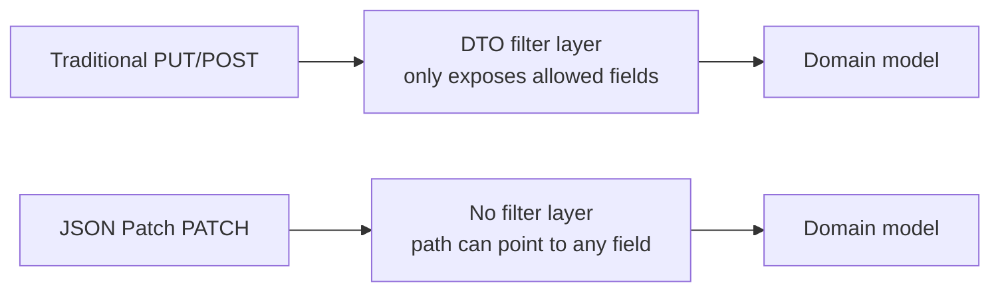
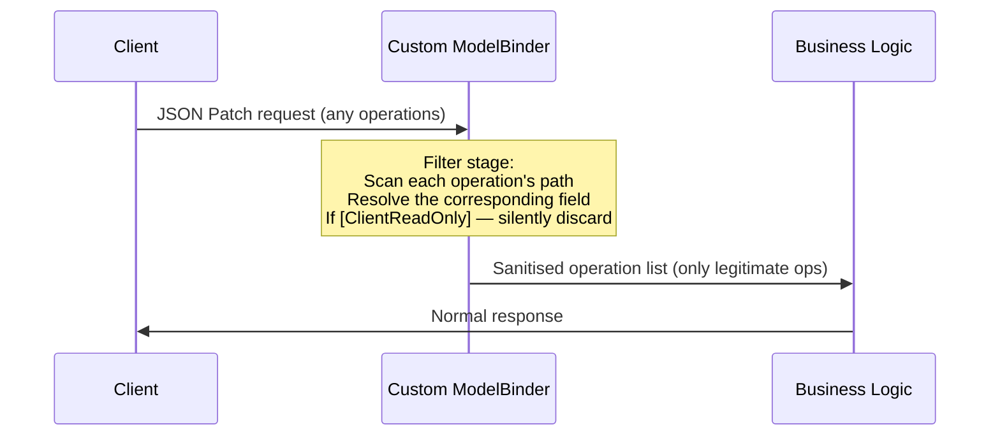
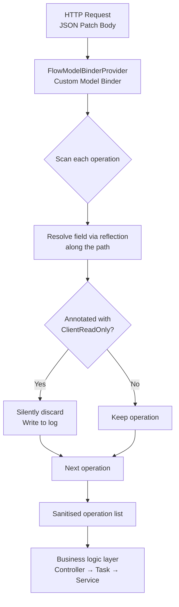

# Preventing Overposting in ASP.NET Core JSON Patch APIs

*A custom Model Binder that enforces field-level access control using annotations*

## 1. It Starts with an Innocent-Looking Request

Imagine you're building a multi-step online form. Each time the user clicks "Next", the frontend only needs to send the fields filled in on that step — not the entire form all over again.

That's a perfectly reasonable requirement. To solve it, we chose **JSON Patch** (RFC 6902, [official spec](https://datatracker.ietf.org/doc/html/rfc6902)) — a standard format specifically designed to describe partial modifications to a JSON document.

A typical JSON Patch request looks like this:

```json
[
  { "op": "replace", "path": "/firstName", "value": "Alice" },
  { "op": "replace", "path": "/dateOfBirth", "value": "1990-01-15" }
]
```

Straightforward enough: two `replace` operations, updating `/firstName` to `"Alice"` and `/dateOfBirth` to `"1990-01-15"`.

So far, so good.

---

## 2. The Problem

Now look at the server-side data model. In a multi-step application, the backend maintains a single "state object" that spans the entire session. It contains two kinds of fields:

```
State Object
├── Fields the user fills in (client may modify)
│   ├── firstName
│   ├── dateOfBirth
│   ├── occupation
│   └── ...
│
└── Fields managed by the server (client must NEVER modify)
    ├── pricingToken        ← token generated by the pricing engine
    ├── policyNumber        ← assigned policy number
    ├── externalReferenceId ← correlation ID from an external system
    ├── redirectionUrl      ← server-injected redirect target
    ├── completedStages     ← stages the user has completed (used by flow guards)
    └── ...
```

The problem: **the `path` in a JSON Patch request can point to any field.**

A malicious user — or a security researcher — can craft a request like this:

```json
[
  { "op": "replace", "path": "/pricingToken", "value": "my-forged-token" },
  { "op": "replace", "path": "/redirectionUrl", "value": "https://evil.example.com" },
  { "op": "replace", "path": "/completedStages", "value": ["step3", "step4"] }
]
```

Without any server-side defence, these operations are executed as-is:
- The pricing token is tampered with — subsequent underwriting calculations are based on forged data
- The redirect URL is overwritten — every dynamically generated link on the page now points to a malicious site
- Completed stages are fabricated — the user can skip flow validation and jump straight to checkout

This is an **Overposting attack**, also known as **Mass Assignment** — a classic vulnerability listed in the OWASP API Security Top 10 ([OWASP API3: Broken Object Property Level Authorization](https://owasp.org/API-Security/editions/2023/en/0xa3-broken-object-property-level-authorization/)).

---

## 3. Why JSON Patch Makes This Harder to See Coming

Mass Assignment exists in traditional REST APIs too, but there's usually a natural layer of protection: developers define a dedicated DTO (request model) that only exposes the fields a client is allowed to set. The server then maps from the DTO to the domain object.

In a JSON Patch workflow, that protection simply doesn't exist:



JSON Patch was designed to let you say precisely what you want to change — but that expressiveness is exactly what widens the attack surface. The target is no longer a constrained DTO; it's the entire state tree.

The framework's default JSON Patch handler (such as ASP.NET Core's `JsonPatchDocument`) has no opinion on whether a given field *should* be writable by a client. It simply executes whatever `path` it's given.

---

## 4. The Obvious Fix — and Why It Falls Short

The first instinct is to check each `path` before processing and reject anything on a blocklist:

```csharp
// Blocklist approach
foreach (var operation in patchOperations)
{
    if (Blocklist.Contains(operation.Path))
        return BadRequest();
}
```

**The problem: a blocklist requires manual maintenance and is inherently reactive.**

Every time a new server-managed field is added to the model, someone has to remember to update the blocklist. That's easy to forget — especially in a fast-moving codebase with multiple contributors.

More fundamentally, this violates the principle that security should be structural, not memorial.

---

## 5. The Right Approach: Let Fields Declare Their Own Access Level

A better model is to move the ownership of the protection rule to the field itself — **declare at definition time whether a field can be modified by the client**, rather than maintaining a separate list somewhere else.

This is the core mechanism we introduced: the **`[ClientReadOnly]` annotation**.

In the model, every server-managed field gets the annotation:

```csharp
public class ApplicationStateModel
{
    // User-provided fields — no annotation, client may modify
    public string FirstName { get; set; }
    public DateTime DateOfBirth { get; set; }

    // Server-managed fields — annotated, client must not modify
    [ClientReadOnly]
    public string PricingToken { get; set; }

    [ClientReadOnly]
    public string PolicyNumber { get; set; }

    [ClientReadOnly]
    public List<string> CompletedStages { get; set; }
}
```

The benefit: **the protection rule lives next to the field definition**. When a developer adds a new field, they're naturally prompted to decide: "Should this be `[ClientReadOnly]`?" The question is asked at the right moment — during design, not during a post-incident review.

---

## 6. Implementation: Intercept at the Model Binding Stage

The annotation alone doesn't do anything. You need a mechanism to **automatically strip out** any Patch operations targeting annotated fields before they reach business logic.

We do this filtering at the **Model Binding stage** — the earliest point in the web framework's request pipeline, before the request body is even deserialised into an object:



The core filtering algorithm:

```csharp
private IList<Operation> FilterClientReadOnlyOperations(
    IList<Operation> operations, Type modelType)
{
    var result = new List<Operation>();

    foreach (var operation in operations)
    {
        // JSON Patch path format: "/fieldName" or "/nested/fieldName"
        var propertyPath = ParsePath(operation.Path);

        // Use reflection to resolve the field at the end of the path
        var property = ResolveProperty(modelType, propertyPath);

        if (property == null)
        {
            // Path points to a non-existent field — discard
            continue;
        }

        if (property.GetCustomAttribute<ClientReadOnlyAttribute>() != null)
        {
            // Annotation hit — silently discard, write to log
            _logger.LogWarning("Blocked ClientReadOnly field: {Path}", operation.Path);
            continue;
        }

        result.Add(operation);
    }

    return result;
}
```

Two implementation details worth calling out:

**1. Path resolution must support nesting**

A JSON Patch `path` can be deeply nested — for example, `/profile/address`. The algorithm needs to walk the path segment by segment (`profile` → `address`) until it reaches the terminal field, then check for the `[ClientReadOnly]` annotation.

**2. Silently discard, don't error**

The filter drops illegal operations silently rather than returning a 400. The reasoning: an attacker should receive no useful feedback (denying reconnaissance). If the operation came from a framework bug or misconfigured tool, discarding is more resilient than breaking the request — and the log entry ensures the issue is still surfaced.

---

## 7. Plugging Into the Framework

In ASP.NET Core, Model Binding behaviour is extended via `IModelBinderProvider`. We implemented a custom `FlowModelBinderProvider` that performs the filtering above before any request reaches an action method, and registered it in the DI container to replace the default binder.

Every JSON Patch endpoint gets this protection automatically — no per-controller or per-action boilerplate required.

The full flow:



---

## 8. A Second Defence Layer: XSS Content Scanning

While building the Overposting defence, we added **XSS content scanning** in the same pipeline at no extra cost: each operation's `value` is checked for dangerous patterns — `<script>` tags, inline event handlers (`onXxx=`), `javascript:` URIs, and similar. If any match, the entire request is rejected before it touches the application.

Together, the two layers form a combined defence:

| Defence layer | Protects against | Behaviour on violation |
|---|---|---|
| `[ClientReadOnly]` filtering | Server fields being overwritten | Silently discard the operation |
| XSS content scanning | Injected scripts entering the system | Reject the entire request (400) |

---

## 9. Proving It Works: The Tests

Any security mechanism without test coverage is a security mechanism you can't trust.

We wrote two test suites for the filtering logic:

**`ModelBinderHelperRemoveOperationsTests`** (validates filtering behaviour):
- A `replace` operation targeting a `[ClientReadOnly]` field → filtered out
- A `replace` operation targeting a non-annotated field → passes through
- A nested path (e.g. `/profile/address`) → correctly resolved and filtered
- A path pointing to a non-existent field → filtered out
- An empty operation list → returns empty normally

**`ModelBinderHelperBindValueTests`** (validates binding behaviour):
- Legitimate operations after filtering are correctly bound to model fields
- After filtering, the server-side value of a protected field remains unchanged

Together, these two suites cover both directions: "filtered what should be filtered" and "kept what should be kept."

---

## 10. Three Principles of Security Design

This implementation prompted us to think more carefully about what good security design actually looks like.

**1. Allowlist over blocklist; declaration over inspection**

A blocklist asks developers to remember "this field is dangerous, so add it." The `[ClientReadOnly]` annotation asks developers to consider "can the client modify this field?" The former is reactive; the latter is built into the design. Their failure modes are different: blocklists fail by omission, annotations fail by mislabelling — and deliberate omissions are far less common than forgotten list entries.

**2. Enforce protection as early in the pipeline as possible**

The filtering happens at the Model Binding stage. By the time business logic runs, the illegal operations don't exist — they were removed at the gate. This mirrors how firewalls work: defence closest to the entry point is hardest to bypass.

**3. Security mechanisms must have tests**

Security code that passes today can silently break during a future refactor. Tests don't just validate "it works now" — they're a regression guard that protects the defence from being accidentally removed later.